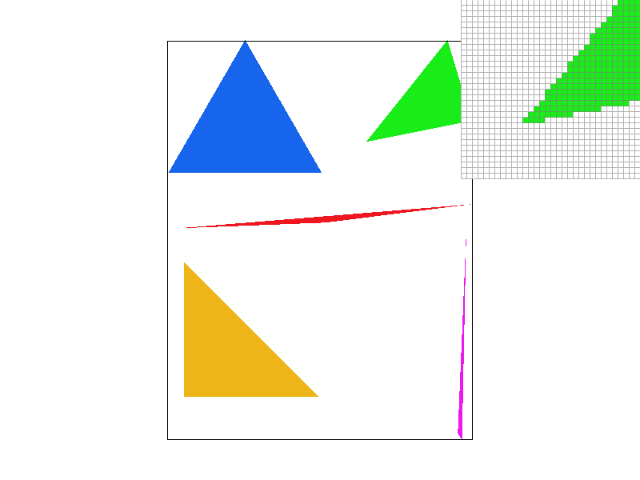
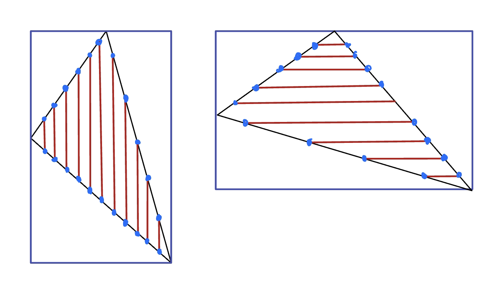
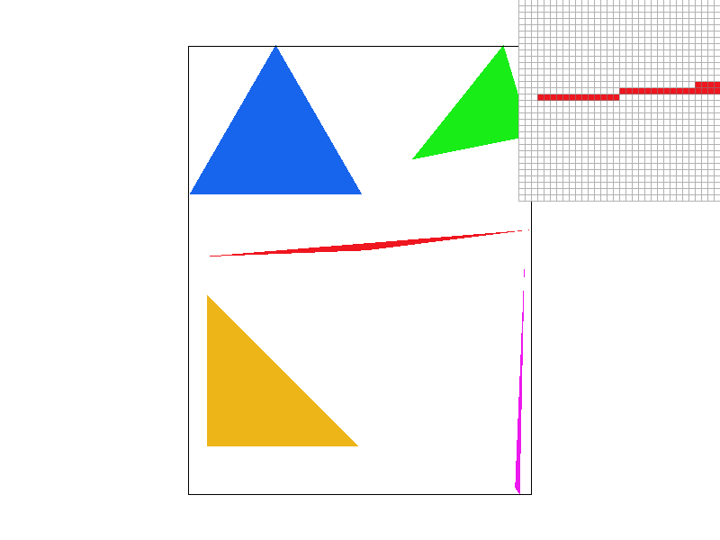
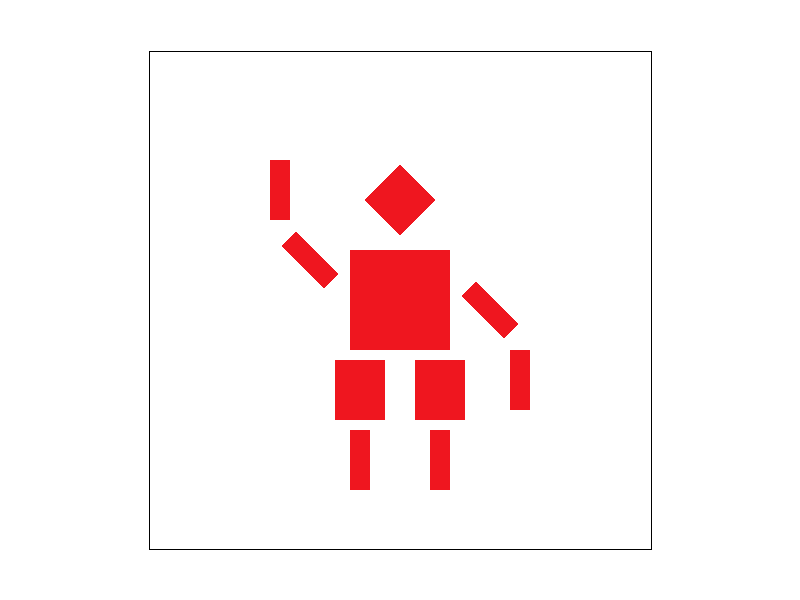
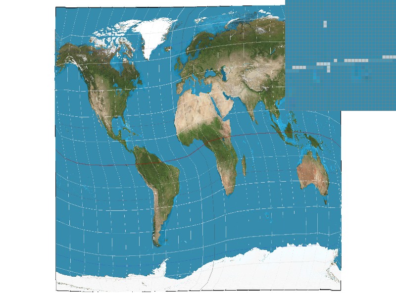
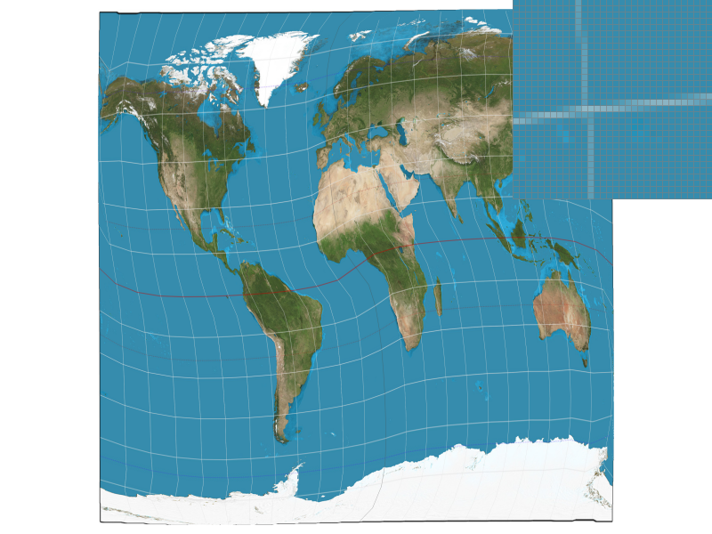
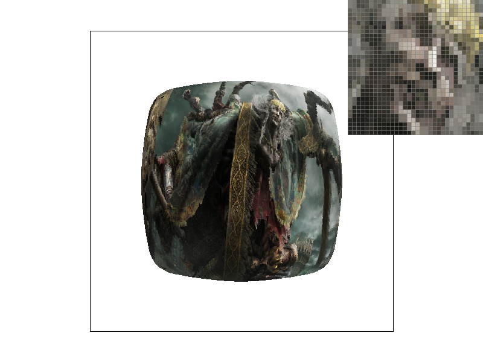

src: https://github.com/D7ry/cs184-proj-writeup/blob/master/proj1/writeup.md
<h1 align="center">CS 184: Computer Graphics and Imaging, Spring 2023</h1>
<h1 align="center">Project 1: Rasterizer</h1>

# Overview
In this project, our group built a functional rasterizer that supports 2D textured geometries. The rasterizer also supports features such as super-sampling and 2D transformations. 

In addition, the user could choose from 3 different mipmap texture sampling methods, as well as 2 different pixel sampling methods.

This project has greatly enhanced our understanding of 2D graphics, as well as our interest in delving further deep into the field of computer graphics. It has also prepared us for future C++ projects by honing our skills with tools like cmake and Visual Studio.

# Section I: Rasterization

## Part 1: Rasterizing single-color triangles

I created my own `Triangle_2D` class and a bunch of structs to keep things organized and well cached to be used later; The following only shows the functions and variables needed for part 1.
```cpp
Class Triangle_2D
{
	Vector2D p0, p1, p2;  //points constructing this triangle
	Edge e0, e1, e2; // Edge struct of the triangle, containg ptrs to the vectors that construct them
	float minX, minY, maxX, maxY; //bounding box

	// for implementation 1
	bool isInside(float a_x, float a_y);
	// for implementation 2
	bool getHorizontalRayHit(float a_y, float& a_xBegin, float& a_xEnd);
	bool getVerticalRayHit(float a_x, float& a_yBegin, float& a_yEnd);
};
```
`Triangle_2D` takes in 6 coordinates to construct.
I've also defined a sub-struct Edge, which simply contains 2 vectors, and a line normal of the edge, calculated at initialization and will be used for Rasterization.
```cpp
enum GeometricRelation
{
	IN,
	OUT,
	ON
};
struct Edge
{
	float a, b; //slope and constant, if the edge were to be repesented in a 2d coordinate.
	float xMin, yMin, xMax, yMax;
	Vector2D* src; Vector2D* dst; // ptr to the vectors constructed this edge; vectors are stored in Triangle_2D
	Vector2D lineNormal; // line normal vector
	Vector2D v; //relative vec from src to dst
	inline GeometricRelation getGeometricRelation(float a_x, float a_y);
	Edge(Vector2D* a_src, Vector2D* a_dst);;
};
```
With the above abstraction, later tasks are much more modular and easier to implement.

### Implementation 1: Sampling everything in the bounding box
Implementation 1 is simple; it involves the following steps:
1. Calculate the bounding box of the triangle; cached in `float minX, minY, maxX, maxY;` of the `Triangle_2D` class.
2. For each pixel in the bounding box, perform a 3-plane test, done as follows:
	- Triangle's `Edge` structs has the function `getGeometricRelation(`float a_x, float a_y)` which outputs whether the absolute coordinate(A_X, A_Y) is inside/outside/on the halfplane constructed by the edge.
	- The triangle will invoke each of the 3 edge's `getGeometricRelation()`, which checks the sign of the dot product of the edge's line normal and the point vector; if all geometric relations indicate that the point is inside the half-plane, the point is inside.
3. If the pixel is inside the triangle, color it onto the sampling buffer.

Implementation 1 is **no worse than** sampling every triangle in the triangle bounding box because it does exactly that.  

Here's an image rendered using implementation 1:
<div align="center"></div>

### Implementation 2: 2D Raycasting

Implementation 2 differs from implementation 1 in that it only samples 2 precise points for each sample unit, then fills in the pixels without sampling.  
The detailed algorithm goes as follows:
1. Compare the triangle's bounding box's width and height, if width > height, proceed to do vertical ray casts, else, proceed to do horizontal raycasts.
2. Start from one side of the bounding box, and keep doing raycasts vertically/horizontally until reaching the other side of the box; this is implemented through `Triangle_2D::getVerticalRayHit`and `Triangle_2D::getHorizontalRayHit`, which looks for the intersection between pairs of linear functions.

Here is a graphical illustration of the algorithm:
<div align="center">
</img>
<figcaption align = "center">the left image has a smaller width than height, which is why the rays are cast vertically.</figcaption>
</div>

Theoretically, this implementation has O(n) speed with n being the min(width, height) of the triangle's bounding box, compared to the O(n2</sup>) complexity of implementation 1. The performance improvement is most noticeable under bigger resolutions.  

Here is a timing comparison(in ticks) between the 2 implementations, both rendering test3, the dragon svg file, under 2560*1440 resolution.  
The numbers below are the differences in `std::clock()` before and after `DrawRend::redraw()` invokes `SVG::draw()`.
<div align="center">
  <table>
    <tr>
      <td></td>
      <td>Native(2K)</td>
      <td>9x SS(8K)</td>
      <td>16x SS(32K)</td>
    </tr>
    <tr>
      <td>Sample Everything</td>
      <td align = "center">32</td>
      <td align = "center">182</td>
      <td align = "center">309</td>
    </tr>
    <tr>
      <td>2D Raycast</td>
      <td align = "center">12</td>
      <td align = "center">31</td>
      <td align = "center">48</td>
    </tr>
  </table>
</div>

further optimizations such as divide-and-conquer can still be made to lower the complexity to O(log<sub>2</sub>n); we plan to implement them in the future.

## Part 2: Antialiasing triangles

Rasterization by sampling inevitably causes jaggies and artifacts around high-frequency samples. **Super-sampling(SS)** is the most naive yet effective way to reduce them: SS simply samples a scaled-up version of the original geometry and scales the sample back down, combining multiple sampled pixels into one, resulting in a much smoother image.

### Implementation

Without super-sampling, the rasterizer's `sample_buffer` is as large as the frame buffer, and drawing onto the frame buffer is a 1-1 mapping process. The rasterization pipeline before SS works as follows:
1. Sample pixels from the triangle using either implementation described in Part 1.
2. Draw the sample buffer onto the frame buffer 1-on-1 at `RasterizerImp::resolve_to_framebuffer()`.

To achieve SS, first, we scale the width and height of the `sample_buffer` by the square root of `sample_rate`,
which made the sample buffer able to contain sample_rate times framebuffer worth of pixels. Algorithmically, this is done by calling `samlpe_buffer.resize(width * height * sample_rate)`, as `samlpe_buffer` is stored as a 1D vector.

The pipeline now looks like this, with green highlighted being the added steps:
1. <span style="color:green;">Scale up the size of sample_buffer by sample_rate.</span>
2. <span style="color:green;">Before initializing <code>Triangle_2D</code>, scale up the coordinates of the triangle, each by sqrt(sample_rate)</span>
3. Sample pixels from the triangle using either implementation described in Part 1.
4. <span style="color:grey;"><s>Draw the sample buffer onto the frame buffer 1-on-1.</s></span>
5. <span style="color:green;">For each pixel to be drawn to the frame buffer, look for the corresponding <code>sample_rate</code> times as many pixels from the sample buffer, and draw the average of the sample pixels' colors onto the frame buffer.

The following is the helper function called in `resolve_to_framebuffer()`, in place of the direct `Color col = sample_buffer[y * width + x];` to draw the average of the sample pixels' colors onto the frame buffer:
```cpp
constexpr float sample_rate_inv(float sample_rate) {
	return 1.f / sample_rate;
}
// Get a color at framebuffer's (X, Y) coordinate, from the sample buffer.
Color RasterizerImp::get_color(size_t x, size_t y) {
	if (x >= width || y >= height || x < 0 || y < 0) {
		return Color::White;
	}
	Color c;
	size_t buffer_x = x * sample_stride; // sample_stride = sqrt(sample_rate)
	size_t buffer_y = y * sample_stride;
	for (int j = buffer_y; j < buffer_y + sample_stride; j++) {
	for (int i = buffer_x; i < buffer_x + sample_stride; i++) {
		c += sample_buffer[j * sample_width + i];
		}
	}
	// Average the color.
	c *= sample_rate_inv(sample_rate);
	return c;
}
```

The following are images rendered without SS and with incrementing levels of SS, from 4x to 16x:
<div align="center">
<table style="max-width: 100%; margin: 50px auto;">
    <tr>
      <td>
        
        <figcaption align="center">No SS</figcaption>
      </td>
      <td>
        
        <figcaption align="center">4X SS</figcaption>
      </td>
      <td>
        
        <figcaption align="center">16X SS</figcaption>
    </tr>
    <br>
  </table>
</div>

The result of the supersized-averaged-downsized image has much smoother edges. This is because pixels on the frame buffer now convey a much more accurate representation of the original geometry, taking into account the average of details missed in none-SS rasterizations, such as the sharp triangular edge that no-ss rasterization lacked the precision to sample.

### Part 3: Transforms

Transforms allow creators to easily manipulate geometries, creating different combinations. Here is a transformed cube man:

<div align = "center"></img>
  <figcaption>The cube man is waving his hand saying hello, which is done by rotating and translating both arms in opposite directions.<br> The cubeman's legs are also scaled up because he never skips leg day.</figcaption>
</div>

# Section II: Sampling

For the following parts, texture sampling functions are implemented as lambdas, whose pointers are passed to:
```cpp
void RasterizerImp::rasterize_triangle_native(
      float x0, float y0, 
      float x1, float y1, 
      float x2, float y2, 
      //Function pointer to return the color at samplebuffer coordinates X and Y
      std::function<Color(double, double, Triangle_2D*)> getColor, 
      //UV coordinates, may be unused
      float u0, float v0,
      float u1, float v1,
      float u2, float v2) 
```
To avoid repetitive code.

## Part 4: Barycentric coordinates

Simply put, the barycentric coordinates of a triangle are a 3-dimensional coordinate system to express the relative position of a point, usually within the triangle.  
The three coordinates are alpha, beta, and gamma, the sum of which is always 1; in addition, the sum of barycentric coordinates multiplied by the corresponding vertex's coordinates is always the point's absolute position.  

Here is an optimized algorithm to calculate the barycentric coordinates of a point within a triangle:
```cpp
Triangle_2D::getBarycentricCoords(float a_x, float a_y, float& r_alpha, float& r_beta, float& r_gamma)
{
	Vector2D v = Vector2D(a_x, a_y);
	Vector2D v2 = v - p0;
	float d20 = dot(v2, v0);
	float d21 = dot(v2, v1);
	r_beta = clamp((d11 * d20 - d01 * d21) / denom, 0.0f, 1.0f);
	r_gamma = clamp((d00 * d21 - d01 * d20) / denom, 0.0f, 1.0f);
	r_alpha = clamp(1.0f - r_beta - r_gamma, 0.0f, 1.0f);
}
```
Various variables depending only on the triangle are being cached as member variables of `Triangle_2D`
```cpp
class Triangle_2D
{
	...
	Vector2D v0, v1;
	float d00, d01, d11;
	float denom;
	...
}
Triangle_2D::Triangle_2D(...) {
	// cache variables
	v0 = p1 - p0, v1 = p2 - p0,
	d00 = dot(v0, v0);
	d01 = dot(v0, v1);
	d11 = dot(v1, v1);
	denom = d00 * d11 - d01 * d01;
}
```

Barycentric coordinates are especially useful in texture & color blending. For example, in the following triangle, each vertex has its distinct color of either R, G, or B. Every pixel is colored based on its corresponding coordinates: the closer the pixel is to one vertex(the bigger the corresponding coordinate is), the more of the color of that edge is blended into the pixel. The result is a triangle of smoothly blended color:

<div align="center">
  <image src="images/P4_Triangle.png" width="50%"></image>
</div>

A closer look at the coloring algorithm looks as follows:
```cpp
Color c1, c2, c3; // colors of the vertices
auto getInterpolatedColor = [c0, c1, c2](int x, int y, Triangle_2D* t) -> Color {
	float alpha, beta, gamma;
	t->getBarycentricCoords(x + 0.5, y + 0.5, alpha, beta, gamma);
	return alpha * c0 + beta * c1 + gamma * c2;
};
```


## Part 5: "Pixel sampling" for texture mapping

2D models are simply polygons. One could fill in colors to the polygon, but the polygon still appears to be but a geometry. Think of a polygon as a "canvas"; the artist needs to print as much detail as possible onto the canvas to make it look like a real object. Instead of painting onto the "canvas" pixel by pixel, we first create a new reference painting,
**texture**, and then print the texture onto the model.

Separating the model from the texture allows the model to be easily scalable and modifiable, using algorithms to adapt models of different sizing to the same texture; the process of adapting the texture to the model is called **texture mapping**.  

Adapting texture to model is analogous to adapting geometry to screen space, the latter is done through **rasterization** by sampling, and the former has a more direct name: **pixel sampling**.  

The idea behind **pixel sampling** is simple: every pixel of a geometry has a 2D relative coordinate called **UV coordinate**, which maps to a specific coordinate on the texture. 
By sampling the texture at the UV coordinate of each pixel using various sampling methods(more on this in Part 6), we can obtain a color for each pixel, and then fill in the pixel with that color.  

**Nearest neighbor** and **Bilinear interpolation** are two prevalent sampling methods. 

While nearest neighbor directly samples the point on texture closest to the given UV coordinate, bilinear interpolation can be seen as the anti-aliasing technique for pixel sampling: It samples the four points closest to the given UV coordinate and then blends the colors of the four points together; the closer the point is to the UC coordinate, the more color from the point gets blended in. The result is a smoother texture at the cost of four times more texture accesses and arithmetic operations.

### Implementation

#### Getting UV coordinates
As discussed above, to obtain UV coordinates, first we obtain the barycentric coordinates of the pixel using the member function `Triangle_2D::getBarycentricCoords(float a_x, float a_y, float& r_alpha, float& r_beta, float& r_gamma)`  

To convert the barycentric coords into UV coords, we perform a blending algorithm similar to color blending discussed in part 4, where we multiply the UV coordinates of each vertex by the corresponding barycentric coordinate, and then sum them up:

```cpp
void RasterizerImp::Triangle_2D::getUV(float a_x, float a_y, Vector2D& r_uv)
{
	float alpha, beta, gamma;
	this->getBarycentricCoords(a_x, a_y, alpha, beta, gamma);
	r_uv = alpha * uv0 + beta * uv1 + gamma * uv2;
};
```

Once we have the UV coordinates, proceed to the next stage of the pipeline by calling `Texture::sample()` with the UV coordinates as a part of the argument.  

`Texture::sample()` then invokes different sampling methods: nearest neighbor and bilinear interpolation, depending on the setting. Note that regardless of the pixel sampling method, we will always be sampling once from the highest resolution texture(mipmap level 0); More sophisticated level sample methods will be discussed in Part 6.

#### Impl: Nearest Neighbor

For nearest neighbor, we simply round the UV coordinates to the nearest integer, and then sample the texture at the corresponding mipmap coordinate by scaling the UV coordinates by the mipmap level's width and height.

```cpp
Color Texture::sample_nearest(Vector2D uv, int level) {
	auto& mip = mipmap[level];
	return mip.get_texel(round(uv.x * mip.width), round(uv.y * mip.height));
}
```

#### Impl: Bilinear Interpolation

As discussed above, bilinear interpolation samples the four points closest to the UV coordinate and then blends the colors of the four points through lerping.  

```cpp
Color Texture::sample_bilinear(Vector2D uv, int level) {
	auto& mip = mipmap[level];
	float x = uv.x * mip.width;
	float y = uv.y * mip.height;
	float x0 = floor(x), x1 = ceil(x), y0 = floor(y), y1 = ceil(y);
	Color c00 = mip.get_texel(x0, y0);
	Color c01 = mip.get_texel(x0, y1);
	Color c10 = mip.get_texel(x1, y0);
	Color c11 = mip.get_texel(x1, y1);

	Color c0 = lerp(c00, c01, y - y0);
	Color c1 = lerp(c10, c11, y - y0);
	return lerp(c0, c1, x - x0);
}
```
### Results and Comparison

The following are four screenshots generated using nearest sampling and bilinear sampling at different SS levels, which illustrate their differences:  

<div align="center">
  <table style="width=100%">
    <tr>
      <td>
        
        <figcaption align="center">Nearest, no SS</figcaption>
      </td>
      <td>
        
        <figcaption align="center">Bilinear, no SS</figcaption>
      </td>
    </tr>
    <br>
    <tr>
      <td>
        
        <figcaption align="center">Nearest, 16x SS</figcaption>
      </td>
      <td>
        
        <figcaption align="center">Bilinear, 16x SS</figcaption>
      </td>
    </tr>
  </table>
</div>

As shown through the pixel inspector, regardless of the SS rate, bilinear interpolation delivers a much smoother longitudinal&latitudial line.  

Under the native resolution, the lines are intermittent points under nearest neighbor sampling, but the bilinear interpolation method successfully renders the contour of the lines.  

Bilinear interpolation still wins under a higher sampling rate; the lines it renders are less jagged than the counterpart.  

Looking at the overall picture, bilinear interpolation renders a much smoother image.  
Their differences are most noticeable at places where texture color changes abruptly: e.g. near a thin line like the longitudinal&latitudinal line.  

The rationale behind is similar to the anti-aliasing technique: the lower the frequency achieved using blending, the smoother the jags-usually occurring at high-frequency areas-are rendered.

## Part 6: "Level sampling" with mipmaps for texture mapping

As discussed in part 5, texture sampling can have artifacts at high-frequency areas for which the model has less than enough pixels to sample. We've discussed 2 ways to minimize the artifacts: super-sampling and interpolated pixel sampling. "Level sampling" is a third way to do so, which comes with its own set of advantages and drawbacks.  

The idea behind level sampling is simple: instead of sampling from the highest resolution texture all the time(as in part 5), we sample from a down-sampled version of the texture (A.K.A. mipmap) depending on the distance between the pixel and the camera. This gives 3 main benefits:
1. Performance. Sampling from a lower-resolution texture is much faster than sampling from a higher-resolution texture.
2. Visual quality. Sampling from a lower resolution texture can reduce the artifacts caused by high-frequency areas, which have been pre-processed during the compression where high-frequency areas are filtered and blended.
3. Memory. Lower-resolution textures simply take up less memory, however, storing mipmap costs an additional 1/3 of the original texture's space.

### Implementation
To accommodate for 6 different combinations of level sampling, `Texture::sample()` has been restructured:
```cpp
Color Texture::sample(const SampleParams& sp) {
  switch (sp.lsm) {
  case LevelSampleMethod::L_ZERO: //level defaults to 0
      {
          switch (sp.psm) {
          case PixelSampleMethod::P_LINEAR:...
          case PixelSampleMethod::P_NEAREST:...
          }
      }
      break;
  case LevelSampleMethod::L_NEAREST:
      {
          switch (sp.psm) {
          case PixelSampleMethod::P_LINEAR:...
          case PixelSampleMethod::P_NEAREST:...
          }
      }
      break;
  case LevelSampleMethod::L_LINEAR: // most mind-boggling one
      {
          switch (sp.psm) {
          case PixelSampleMethod::P_LINEAR:...
          case PixelSampleMethod::P_NEAREST:...
          }
      }
      break;
  }
  // return magenta for invalid level
  return Color(1, 0, 1);
}
```

#### Getting mipmap level
Regardless of the specific texture sampling method we use, first, we need to approximate the nearest mipmap level to the pixel by calculating the texture footprint. To do so, we calculate the UV of points next to the point to be sampled and approximate the delta UV.   

This is done at the rasterizer part of the pipeline, where we have access to the triangle's UV coordinates:

```cpp
SampleParams sp;
auto getTexture = [tex, sp](double x, double y, Triangle_2D* t) mutable -> Color {
  t->getUV(x, y, sp.p_uv);
  // ready x_dUV and y_dUV for mipmap level calculation.
  if (sp.lsm != LevelSampleMethod::L_ZERO) { 
  // look for nearest uv that's not out of bound
    int dx = t->isInside(x + 1, y) ? 1 : -1;
    int dy = t->isInside(x, y + 1) ? 1 : -1;
    t->getUV(x + dx, y, sp.p_dx_uv); // uv of nearest x coordinate
    t->getUV(x, y + dy, sp.p_dy_uv); // uv of nearest y coordinate
    sp.p_dx_uv -= sp.p_uv;
    sp.p_dy_uv -= sp.p_uv;
  }
  return tex.sample(sp);
};
```

In the texture sampler part of the pipeline, we take the texture footprint and, using the scaled UV, calculate the mipmap level with the normalized UV:

```cpp
float Texture::get_level(const SampleParams& sp) {
  bool linear = false; // do not round the level if linear.
  switch (sp.lsm) {
    case LevelSampleMethod::L_ZERO: // always return 0
    return 0; break; 
    case LevelSampleMethod::L_NEAREST:
    linear = false; break;
    case LevelSampleMethod::L_LINEAR:
    linear = true; break;
  }
  Vector2D dxUV_Scaled = sp.p_dx_uv * width, dyUV_Scaled = sp.p_dy_uv * height;
  double L = max(dxUV_Scaled.norm(), dyUV_Scaled.norm()); // norm = sqrt(x**2 + y**2)
  float d = clamp(static_cast<float>(log2(L)), 0.f, static_cast<float>(mipmap.size() - 1));
  if (linear) { return d;}
  else { return round(d);}
}
```

The level of the returned function is not rounded for bilinear level sampling, which will be discussed later.

#### Nearest Level  

Nearest-level sampling is implemented the same as 0th-level sampling. The texture sampler takes the output of `get_level()` and samples from the mipmap of the corresponding level. `get_texel()` provides a nice abstraction so we don't need to worry about mipmap's width and height.

```cpp
case LevelSampleMethod::L_NEAREST:
{
    switch (sp.psm) {
    case PixelSampleMethod::P_LINEAR:
        return sample_bilinear(sp.p_uv, int(get_level(sp))); break;
    case PixelSampleMethod::P_NEAREST:
        return sample_nearest(sp.p_uv, int(get_level(sp))); break;
    }
}
break;
```

#### Bilinear Interpolated Level
Bilinear interpolated level sampling works analogously to that pixel sampling. Instead of sampling from a single texel, we sample from 2 adjacent texels in the mipmap level, and interpolate the result using `lerp()`:
```cpp
case LevelSampleMethod::L_LINEAR: // most mind-boggling one
{
    float level = get_level(sp);
    int l0 = floor(level), l1 = ceil(level); // 2 adjacent levels
    Color c0, c1;
    switch (sp.psm) {
    case PixelSampleMethod::P_LINEAR:
        c0 = sample_bilinear(sp.p_uv, l0);
        c1 = sample_bilinear(sp.p_uv, l1);
        break;
    case PixelSampleMethod::P_NEAREST:
        c0 = sample_nearest(sp.p_uv, l0);
        c1 = sample_nearest(sp.p_uv, l1);
        break;
    }
return lerp(c0, c1, level - l0);
}
```
Bilinear level sampling can be further combined with bilinear texture sampling, leading the trilinear sampling with the best quality at the cost of performance.

To compare and contrast pixel sampling, level sampling, and supersampling:

Supersampling achieves the best quality by compressing multiple pixels into one at the most performance cost.

Bilinear pixel sampling is less performance intensive by sampling from 4 adjacent texels; it provides some quality improvement over nearest pixel sampling.

Level sampling(nearest/bilinear) is the best of both worlds: it provides a decent quality improvement over bilinear pixel sampling and is less performance intensive than supersampling. It takes extra space to store the mipmap but saves unnecessary memory access. For nearest-level sampling, the quality improvement comes with little cost, as the frequency filter is applied during mipmap generation. For bilinear-level sampling, quality improvement is still a good trade-off.

The visual difference is best illustrated by the following images, generated with different combinations of pixel and level sampling methods.

<div align="center">
  <table style="width=100%">
    <tr>
      <td>
        
        <figcaption align="center">L_ZERO, P_NEAREST</figcaption>
      </td>
      <td>
        
        <figcaption align="center">L_ZERO, P_LINEAR</figcaption>
      </td>
    </tr>
    <br>
    <tr>
      <td>
        
        <figcaption align="center">L_NEAREST, P_NEAREST</figcaption>
      </td>
      <td>
        
        <figcaption align="center">L_NEAREST, P_LINEAR</figcaption>
      </td>
    </tr>
  </table>
</div>
