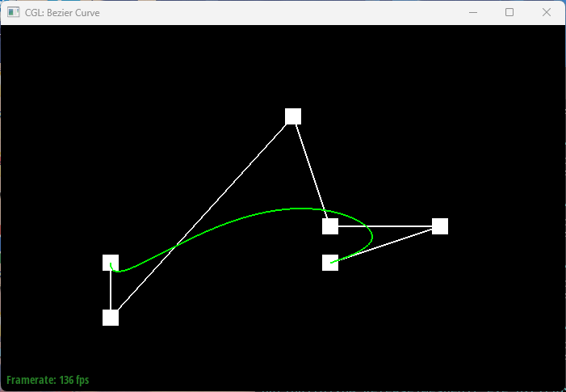
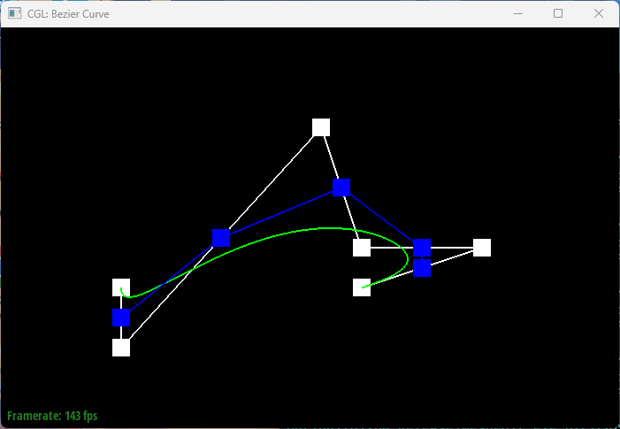
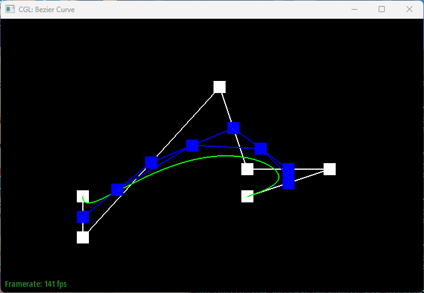
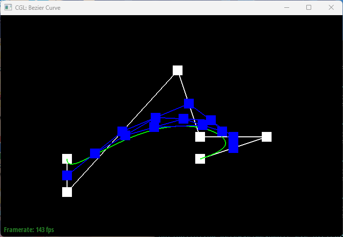
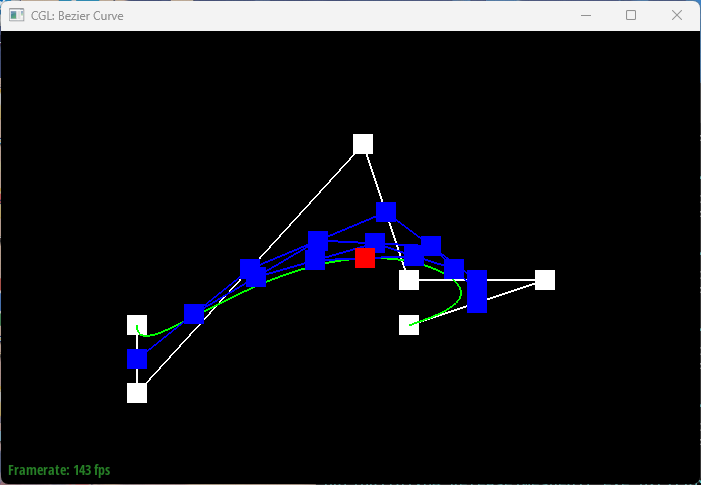
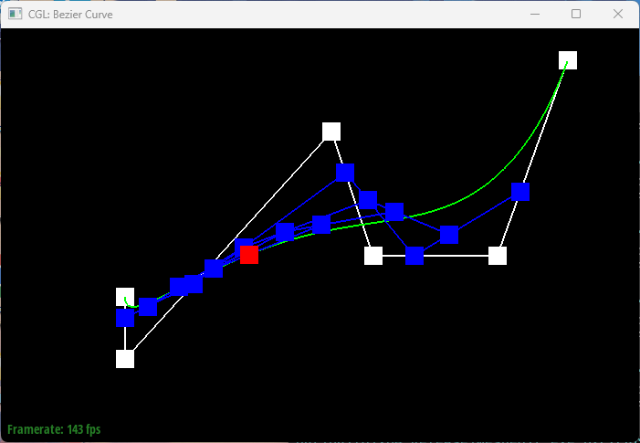
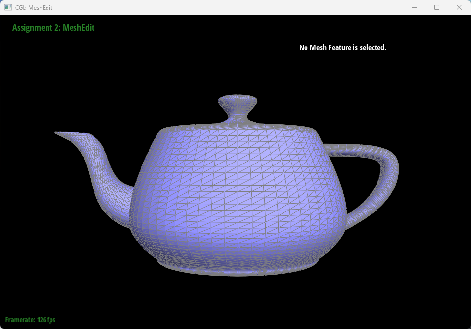
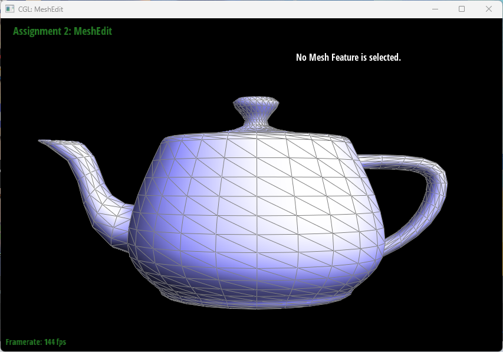

# CS 184: Computer Graphics and Imaging, Spring 2023
# Project 2: Mesh Edit

## Overview

## Section I: Bezier Curves and Surfaces

### Part 1: Bezier Curves with 1D de Casteljau Subdivision

#### Briefly explain de Casteljau's algorithm and how you implemented it in order to evaluate Bezier curves.

##### Explanation
De Castelijau's algorithm is a recursive method to evaluate the points on a bezier curve through a set of control points. The algorithm takes a set of control points and during each pass, for every two adjacent control points, evaluates one control point in the middle through lerping in regards to a constant value `t`. The algorithm stops when there is only one control point left, which is the point on the curve. 

##### Implementation
To implement the algorithm for bezier curve evaluation, we implemented a function to do a single de castelijau pass, and then iteratively call the function until there is only one point left; the single pass algorithm looks as follows:
```cpp
/// <summary>
/// Given a vector of points IN, output a vector of points of size IN.size() - 1, interpolated using de Casteljau's algorithm.
/// </summary>
template <typename T>
void deCasteljauHack(std::vector<T> const& in, std::vector<T>& out, double t) {
	ASSERT(in.size() > 1); // need at least 2 points to interpolate
	for (int i = 0; i < in.size() - 1; i++) {
		out.push_back((1 - t) * in[i] + t * in[i + 1]);
	}
	ASSERT(in.size() - 1 == out.size()); // out should be one less than in.
}
```
The function is implemented as a template function so to be able to handle both `Vector2` and `Vector3` types 
#### Take a look at the provided .bzc files and create your own Bezier curve with 6 control points of your choosing. Use this Bezier curve for your screenshots below.
<div align="middle">
  
</div>
<br>

#### Show screenshots of each step / level of the evaluation from the original control points down to the final evaluated point. Press E to step through. Toggle C to show the completed Bezier curve as well.

<div align="middle">
  <table style="width:100%">
    <tr align="center">
      <td>
        
        <figcaption>Level 0</figcaption>
      </td>
      <td>
        
        <figcaption>Level 1</figcaption>
      </td>
    </tr>
    <br>
    <tr align="center">
      <td>
        
        <figcaption>Level 2</figcaption>
      </td>
      <td>
        
        <figcaption>Level 3</figcaption>
      </td>
    </tr>
    <br>
    <tr align="center">
      <td>
        
        <figcaption>Level 4</figcaption>
      </td>
    </tr>
  </table>
</div>
<br>

#### Show a screenshot of a slightly different Bezier curve by moving the original control points around and modifying the parameter via mouse scrolling.

<div align="middle">
  
</div>
<br>

### Part 2: Bezier Surfaces with Separable 1D de Casteljau

#### Briefly explain how de Casteljau algorithm extends to Bezier surfaces and how you implemented it in order to evaluate Bezier surfaces.

##### Explanation
A bezier surface is defined by a set of control points arranged in a matrix-like grid.
The de Casteljau algorithm can be extended to bezier surfaces by the following 2 steps:
1. Evaluate the bezier curve for each row of control points in 3d space, using parameter u; store the temporary result in the column direction
2. Evaluate the bezier curve for each column of control points in 3d space, using parameter v, the final result should be a single point in 3d space

##### Implementation
To implement bezier surface algorithm, we iteratively call `evaluateStep()` which internally invokes `deCasteljauHack` defined above for step(1), and then aggregate the results of step(1) by iteratively calling `evaluateStep()` yet again. The code portion looks as follows:

```cpp
std::vector<Vector3D> BezierPatch::evaluateStep(std::vector<Vector3D> const& points, double t) const
{
	std::vector<Vector3D> ret;
	deCasteljauHack(points, ret, t);
	return ret;
}
Vector3D BezierPatch::evaluate1D(std::vector<Vector3D> const& a_points, double t) const
{
	if (a_points.size() < 1) {
		CRIT("evaluate1D: not enough control points to evaluate.");
	}
	std::vector<Vector3D> points = a_points;
	while (points.size() != 1) {
		points = evaluateStep(points, t);
	}
	return points[0];
}
Vector3D BezierPatch::evaluate(double u, double v) const
{
	std::vector<Vector3D> column;
	for (std::vector<Vector3D> row : controlPoints) {
		column.push_back(evaluate1D(row, u));
	}
	return evaluate1D(column, v);
}
```
#### Show a screenshot of bez/teapot.bez (not .dae) evaluated by your implementation.

<div align="middle">
  
</div>
<br>

## Section II: Triangle Meshes and Half-Edge Data Structure

### Part 3: Area-Weighted Vertex Normals

#### Briefly explain how you implemented the area-weighted vertex normals.

##### Explanation

The area-weighted vertex normal of a vertex `V` is the approximate unit normal at `V`, computed by taking the area-weighted average of the normals of neighboring triangles, then normalizing.

##### Implementation

To compute the area-weighted vertex normal, we first get the neighboring triangles of the vertex by iterating through its half-edges(looping until the current half-edge iterator is identical to the iterator at the beginning of the looping process), and then compute the 1. area and 2. normal of the triangle, adding the production of the area and normal to the vertex normal, which is then normalized at the end.

One optimization that could be made is to ignore the 0.5 constant when calculating the area using the cross-product of 2 vertices. This is because we're normalizing the return value at the end, so the constant 0.5 will be canceled out. Another optimization is to directly add the cross product of 2 vertices to the return value, instead of calculating the product of area and normal; this is because the area is simply `cross(v1, v2) * 0.5`, which is canceled out again by the unit of the normal.

The code portion looks as follows:
```cpp
Vector3D Vertex::normal(void) const
{
  Vector3D ret = Vector3D(0, 0, 0);
  auto it = halfedge();
  auto begin = it;
  //https://cs184.eecs.berkeley.edu/sp20/lecture/8-24/meshes-and-geometry-processing
  Vector3D a = this->position;
  do {
    Vector3D c = it->next()->vertex()->position;
    it = it->twin()->next();
    Vector3D b = it->next()->vertex()->position;
    // relative vec of 2 edges
    Vector3D e1 = b - a;
    Vector3D e2 = c - a;
    Vector3D normal = cross(e1, e2);
    ret += normal;
  } while (it != begin);
  ret.normalize();
  return ret;
}
```

#### Show screenshots of dae/teapot.dae (not .bez) comparing teapot shading with and without vertex normals. Use Q to toggle default flat shading and Phong shading.

<div align="middle">
  <table style="width:100%">
    <tr align="center">
      <td>
        
        <figcaption>Flat shading</figcaption>
      </td>
      <td>
        
        <figcaption>Phong shading</figcaption>
      </td>
    </tr>
    <br>
  </table>
</div>
<br>

### Part 4: Edge Flip

#### Briefly explain how you implemented the edge flip operation and describe any interesting implementation / debugging tricks you have used.

#### Show screenshots of the teapot before and after some edge flips.

#### Write about your eventful debugging journey, if you have experienced one.

### Part 5: Edge Split

#### Briefly explain how you implemented the edge split operation and describe any interesting implementation / debugging tricks you have used.

#### Show screenshots of a mesh before and after some edge splits.

#### Show screenshots of a mesh before and after a combination of both edge splits and edge flips.

#### Write about your eventful debugging journey, if you have experienced one.

#### If you have implemented support for boundary edges, show screenshots of your implementation properly handling split operations on boundary edges.

### Part 6: Loop Subdivision for Mesh Upsampling

#### Briefly explain how you implemented the loop subdivision and describe any interesting implementation / debugging tricks you have used.

#### Take some notes, as well as some screenshots, of your observations on how meshes behave after loop subdivision. What happens to sharp corners and edges? Can you reduce this effect by pre-splitting some edges?

#### Load dae/cube.dae. Perform several iterations of loop subdivision on the cube. Notice that the cube becomes slightly asymmetric after repeated subdivisions. Can you pre-process the cube with edge flips and splits so that the cube subdivides symmetrically? Document these effects and explain why they occur. Also explain how your pre-processing helps alleviate the effects.

#### If you have implemented any extra credit extensions, explain what you did and document how they work with screenshots.


