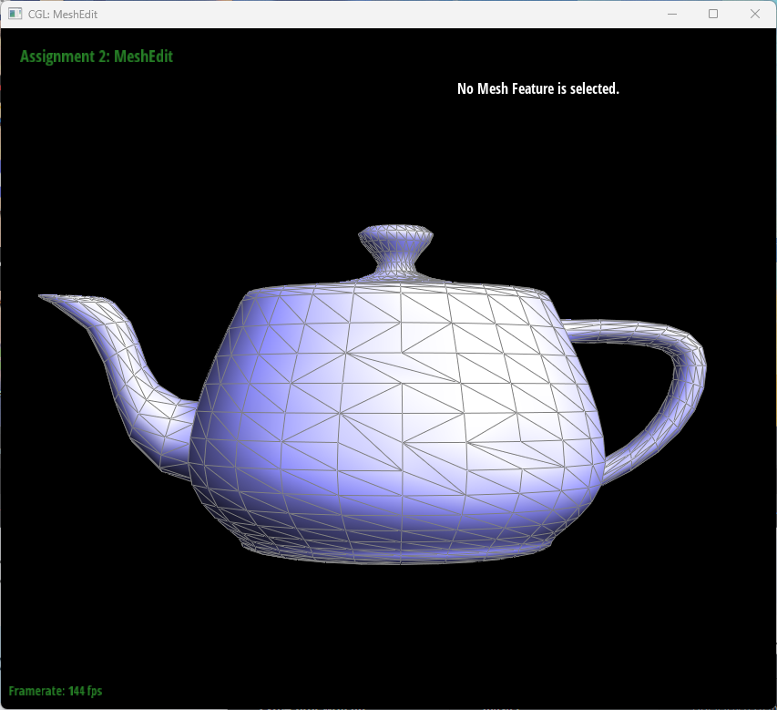
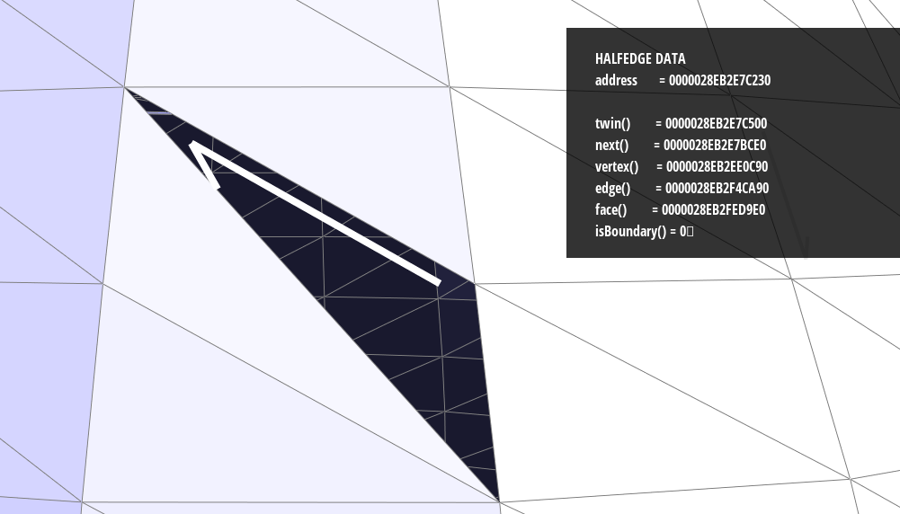
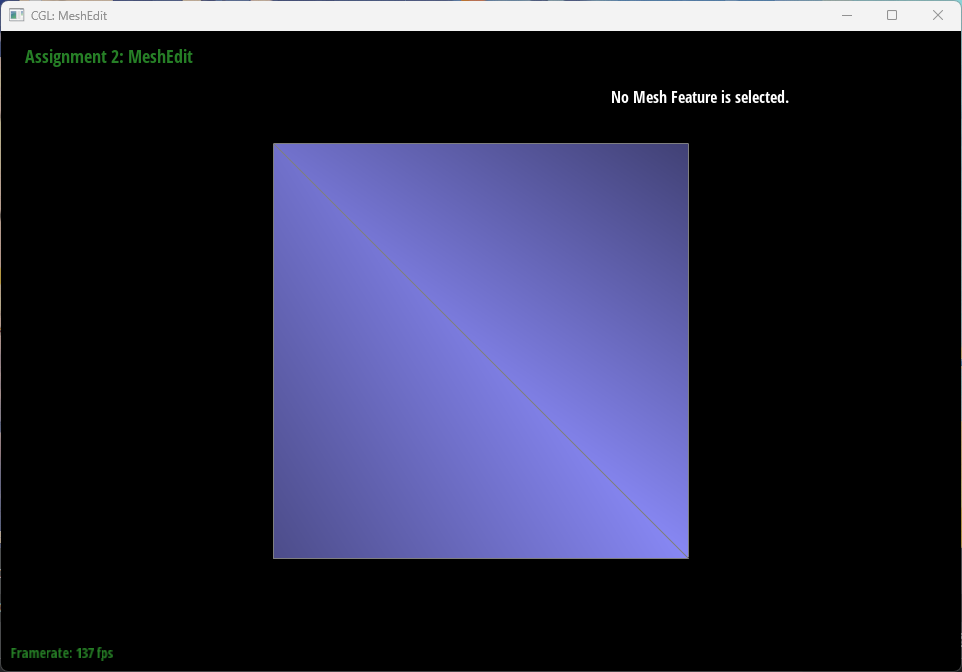
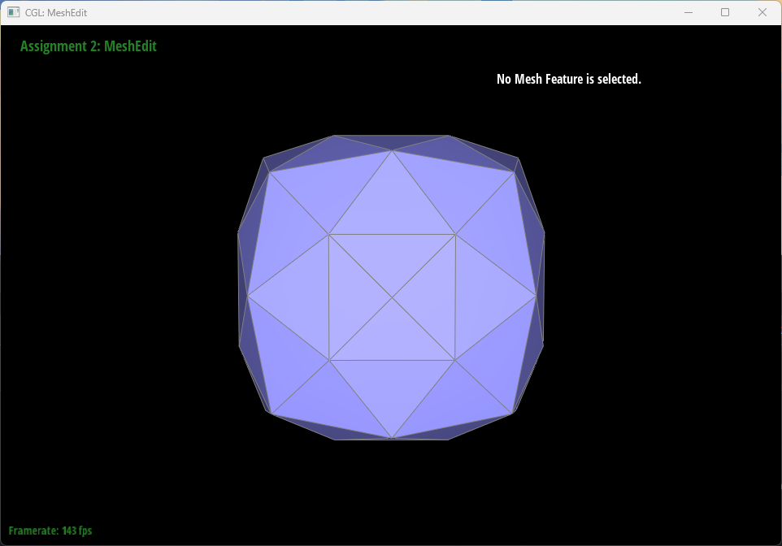

https://github.com/D7ry/cs184-proj-writeup/blob/master/proj2/writeup.md
# CS 184: Computer Graphics and Imaging, Spring 2023
# Project 2: Mesh Edit

## Overview

In this project, we implemented de Casteljau's algorithm to evaluate Bezier curves and surfaces, as well as a functional mesh editor that allows users to flip, split, and subdivide edges and faces of a mesh. The underlying mesh data structure is inspired by the half-edge data structure, the traversal of which powers the editing functions. The mesh editor is implemented in OpenGL and C++.

## Section I: Bezier Curves and Surfaces

### Part 1: Bezier Curves with 1D de Casteljau Subdivision

#### Briefly explain de Casteljau's algorithm and how you implemented it in order to evaluate Bezier curves.

##### Explanation
De Castelijau's algorithm is a recursive method to evaluate the points on a bezier curve through a set of control points. The algorithm takes a set of control points and during each pass, for every two adjacent control points, evaluates one control point in the middle through lerping in regards to a constant value `t`. The algorithm stops when there is only one control point left, which is the point on the curve. 

##### Implementation
To implement the algorithm for bezier curve evaluation, we implemented a function to do a single de castelijau pass, and then iteratively call the function until there is only one point left; the single pass algorithm looks as follows:
```cpp
/// <summary>
/// Given a vector of points IN, output a vector of points of size IN.size() - 1, interpolated using de Casteljau's algorithm.
/// </summary>
template <typename T>
void deCasteljauHack(std::vector<T> const& in, std::vector<T>& out, double t) {
	ASSERT(in.size() > 1); // need at least 2 points to interpolate
	for (int i = 0; i < in.size() - 1; i++) {
		out.push_back((1 - t) * in[i] + t * in[i + 1]);
	}
	ASSERT(in.size() - 1 == out.size()); // out should be one less than in.
}
```
The function is implemented as a template function so to be able to handle both `Vector2` and `Vector3` types 
#### Take a look at the provided .bzc files and create your own Bezier curve with 6 control points of your choosing. Use this Bezier curve for your screenshots below.
<div align="middle">
  
</div>
<br>

#### Show screenshots of each step / level of the evaluation from the original control points down to the final evaluated point. Press E to step through. Toggle C to show the completed Bezier curve as well.

<div align="middle">
  <table style="width:100%">
    <tr align="center">
      <td>
        
        <figcaption>Level 0</figcaption>
      </td>
      <td>
        
        <figcaption>Level 1</figcaption>
      </td>
    </tr>
    <br>
    <tr align="center">
      <td>
        
        <figcaption>Level 2</figcaption>
      </td>
      <td>
        
        <figcaption>Level 3</figcaption>
      </td>
    </tr>
    <br>
    <tr align="center">
      <td>
        
        <figcaption>Level 4</figcaption>
      </td>
    </tr>
  </table>
</div>
<br>

#### Show a screenshot of a slightly different Bezier curve by moving the original control points around and modifying the parameter via mouse scrolling.

<div align="middle">
  
</div>
<br>

### Part 2: Bezier Surfaces with Separable 1D de Casteljau

#### Briefly explain how de Casteljau algorithm extends to Bezier surfaces and how you implemented it in order to evaluate Bezier surfaces.

##### Explanation
A bezier surface is defined by a set of control points arranged in a matrix-like grid.
The de Casteljau algorithm can be extended to bezier surfaces by the following 2 steps:
1. Evaluate the bezier curve for each row of control points in 3d space, using parameter u; store the temporary result in the column direction
2. Evaluate the bezier curve for each column of control points in 3d space, using parameter v, the final result should be a single point in 3d space

##### Implementation
To implement bezier surface algorithm, we iteratively call `evaluateStep()` which internally invokes `deCasteljauHack` defined above for step(1), and then aggregate the results of step(1) by iteratively calling `evaluateStep()` yet again. The code portion looks as follows:

```cpp
std::vector<Vector3D> BezierPatch::evaluateStep(std::vector<Vector3D> const& points, double t) const
{
	std::vector<Vector3D> ret;
	deCasteljauHack(points, ret, t);
	return ret;
}
Vector3D BezierPatch::evaluate1D(std::vector<Vector3D> const& a_points, double t) const
{
	if (a_points.size() < 1) {
		CRIT("evaluate1D: not enough control points to evaluate.");
	}
	std::vector<Vector3D> points = a_points;
	while (points.size() != 1) {
		points = evaluateStep(points, t);
	}
	return points[0];
}
Vector3D BezierPatch::evaluate(double u, double v) const
{
	std::vector<Vector3D> column;
	for (std::vector<Vector3D> row : controlPoints) {
		column.push_back(evaluate1D(row, u));
	}
	return evaluate1D(column, v);
}
```
#### Show a screenshot of bez/teapot.bez (not .dae) evaluated by your implementation.

<div align="middle">
  
</div>
<br>

## Section II: Triangle Meshes and Half-Edge Data Structure

### Part 3: Area-Weighted Vertex Normals

#### Briefly explain how you implemented the area-weighted vertex normals.

##### Explanation

The area-weighted vertex normal of a vertex `V` is the approximate unit normal at `V`, computed by taking the area-weighted average of the normals of neighboring triangles, then normalizing.

##### Implementation

To compute the area-weighted vertex normal, we first get the neighboring triangles of the vertex by iterating through its half-edges(looping until the current half-edge iterator is identical to the iterator at the beginning of the looping process), and then compute the 1. area and 2. normal of the triangle, adding the production of the area and normal to the vertex normal, which is then normalized at the end.

One optimization that could be made is to ignore the 0.5 constant when calculating the area using the cross-product of 2 vertices. This is because we're normalizing the return value at the end, so the constant 0.5 will be canceled out. Another optimization is to directly add the cross product of 2 vertices to the return value, instead of calculating the product of area and normal; this is because the area is simply `cross(v1, v2) * 0.5`, which is canceled out again by the unit of the normal.

The code portion looks as follows:
```cpp
Vector3D Vertex::normal(void) const
{
  Vector3D ret = Vector3D(0, 0, 0);
  auto it = halfedge();
  auto begin = it;
  //https://cs184.eecs.berkeley.edu/sp20/lecture/8-24/meshes-and-geometry-processing
  Vector3D a = this->position;
  do {
    Vector3D c = it->next()->vertex()->position;
    it = it->twin()->next();
    Vector3D b = it->next()->vertex()->position;
    // relative vec of 2 edges
    Vector3D e1 = b - a;
    Vector3D e2 = c - a;
    Vector3D normal = cross(e1, e2);
    ret += normal;
  } while (it != begin);
  ret.normalize();
  return ret;
}
```

#### Show screenshots of dae/teapot.dae (not .bez) comparing teapot shading with and without vertex normals. Use Q to toggle default flat shading and Phong shading.

<div align="middle">
  <table style="width:100%">
    <tr align="center">
      <td>
        
        <figcaption>Flat shading</figcaption>
      </td>
      <td>
        
        <figcaption>Phong shading</figcaption>
      </td>
    </tr>
    <br>
  </table>
</div>
<br>

### Part 4: Edge Flip

#### Briefly explain how you implemented the edge flip operation and describe any interesting implementation / debugging tricks you have used.

Any arbitrary edge of a 3D geometry can be seen as a part of a half-edge complex[^1] consisting of a multitude of edges, half-edges, vertices, and faces. To flip an edge, we changed the relations between the edge and its neighboring half-edge elements by adjusting pointers. Since no new half-edge element is created or destroyed, we simply repurpose some half-edge elements in place of others. One thing to note is that boundary-edges are not flippable, to which we simply return the original boundary edge.

In terms of the actual algorithm, first, we get the half-edge complex by traversing the half-edges in the following code; `populate_edge_complex()` will also be reused in part5.
```cpp
inline void populate_edge_complex(EdgeIter& e0,
  EdgeIter& e1, EdgeIter& e2, EdgeIter& e3, EdgeIter& e4,
  HalfedgeIter& h0, HalfedgeIter& h1, HalfedgeIter& h2, HalfedgeIter& h3, HalfedgeIter& h4, HalfedgeIter& h5, HalfedgeIter& h6, HalfedgeIter& h7, HalfedgeIter& h8, HalfedgeIter& h9,
  VertexIter& v0, VertexIter& v1, VertexIter& v2, VertexIter& v3,
  FaceIter& f0, FaceIter& f1) {
  //Halfedges
  h0 = e0->halfedge();
  h1 = h0->next();
  h2 = h1->next();
  h3 = h0->twin();
  h4 = h3->next();
  h5 = h4->next();
  h6 = h1->twin();
  h7 = h2->twin();
  h8 = h4->twin();
  h9 = h5->twin();
  //Vertices
  v0 = h0->vertex();
  v1 = h3->vertex();
  v2 = h2->vertex();
  v3 = h5->vertex();
  //Edges
  e1 = h1->edge();
  e2 = h2->edge();
  e3 = h4->edge();
  e4 = h5->edge();
  //Faces
  f0 = h0->face();
  f1 = h3->face();
}
```

Then, we adjust the pointers; our algorithm works slightly differently from the CMU doc in that we do not "rotate" the edges along with the flipped edge to maintain consistency from face pointers to the edges; instead we rotate the edge alone and adjust the affected pointers accordingly.
```cpp
EdgeIter HalfedgeMesh::flipEdge(EdgeIter e0)
{
  if (e0->isBoundary()) { // do nothing at boundary
    return e0;
  }
  // get all it related to E0
  HalfedgeIter h0, h1, h2, h3, h4, h5, h6, h7, h8, h9;
  VertexIter v0, v1, v2, v3;
  EdgeIter e1, e2, e3, e4; // e0 is already assigned
  FaceIter f0, f1;
  populate_edge_complex(e0, e1, e2, e3, e4, h0, h1, h2, h3, h4, h5, h6, h7, h8, h9, v0, v1, v2, v3, f0, f1);
  // reconfigure possibly affected vertices
  {
    v0->halfedge() = h7;
    v1->halfedge() = h9;
  }
  // reset halfedge pointers
  {
    h3->setNeighbors(h5, h0, v2, e0, f1);
    h0->setNeighbors(h2, h3, v3, e0, f0);
  }
  // reconfigure possibly affected faces
  { // faces may point to half-edges that don't belong to them anymore.
    f0->halfedge() = h0;
    f1->halfedge() = h3;
  }
  // reconfigure affected halfedges
  {
    { //reset order
      //outs
      h2->next() = h4; // h2.next used to be h0
      h5->next() = h1; // h5.next used to be h3
      //ins
      h4->next() = h0;
      h1->next() = h3;
    }
    { //reset faces
      h1->face() = f1;
      h4->face() = f0;
    }
  }
  return e0;
}
```

Adjusting pointers is extremely error-prone; we wrote the following functions to help us check half-edge element relations and consistencies(they're a lot more useful than the `CHECK` functions in the starter code):
```cpp
  static bool is_closed(std::vector<HalfedgeIter>& a_halfedges) {
    ASSERT(a_halfedges.size() > 1);
    for (int i = 0; i < a_halfedges.size() - 1; i++) {
      auto it = a_halfedges[i];
      if (it->next() != a_halfedges[i + 1]) {
        return false;
      }
    }
    if (a_halfedges[a_halfedges.size() - 1]->next() != a_halfedges[0]) {
      return false;
    }
    return true;
  }
#define CHECK_CLOSED(...) ASSERT(Debug::is_closed(std::vector<HalfedgeIter>{__VA_ARGS__}))
  static bool is_face_of(FaceIter a_face, std::vector<HalfedgeIter>& a_halfedges) {
    for (auto i : a_halfedges) { // check ptr from edge to face
      if (i->face() != a_face) {
        return false;
      }
    }
    auto it = a_face->halfedge(); // check ptr from face to edges
    do {
      if (std::find(a_halfedges.begin(), a_halfedges.end(), it) == a_halfedges.end()) {
        return false;
      }
      it = it->next();
    } while (it != a_face->halfedge());
    return true;
  }
#define CHECK_FACE(face, ...) ASSERT(Debug::is_face_of(face, std::vector<HalfedgeIter>{__VA_ARGS__}))
  static bool is_vertex_of(VertexIter a_vertex, std::vector<HalfedgeIter> a_halfedges) {
    ASSERT(a_halfedges.size() > 0)
    for (auto i : a_halfedges) { // check ptr from edge to vertex
      if (i->vertex() != a_vertex) {
        return false;
      }
    }
    auto it = a_vertex->halfedge();
    do {
      auto f = std::find(a_halfedges.begin(), a_halfedges.end(), it);
      if (f != a_halfedges.end()) {
        a_halfedges.erase(f); // remove found edge
      }
      it = it->twin()->next();
    } while (it != a_vertex->halfedge());
    return a_halfedges.size() == 0;
  }
#define CHECK_VERTEX(vertex, ...) ASSERT(Debug::is_vertex_of(vertex, std::vector<HalfedgeIter>{__VA_ARGS__}))
```

#### Show screenshots of the teapot before and after some edge flips.

<div align="middle">
  <table style="width:100%">
    <tr align="center">
      <td>
        
        <figcaption>Before flip</figcaption>
      </td>
      <td>
        
        <figcaption>After filp</figcaption>
      </td>
    </tr>
    <br>
  </table>
</div>
<br>

#### Write about your eventful debugging journey, if you have experienced one.

Things went generally pretty smooth; I had a hard time trying to figure out one face "disappearing" when all the half-edges around it are geometrically correct and point to the face. This turns out to be caused by forgetting to adjust pointers from `Face` to `HalfEdge`, despite having already adjusted pointers from `HalfEdge` to `Face`.

<div align="middle">
  
</div>
<br>

### Part 5: Edge Split

#### Briefly explain how you implemented the edge split operation and describe any interesting implementation / debugging tricks you have used.

Edge split cuts the targeted edge in half, and connects the vertex that cuts the edge in half to the two adjacent vertices; during this process, several new half-edge elements are created:
- 1 new `Vertex`
- 3 new `Edge`
- 6 new `Halfedge`
- 2 new `Face`

The process is best illustrated by the following diagram:

<div align="middle">
  
</div>
<br>

newly created elements are highlighted in red and have letter suffixes. In addition to creating new elements, we adjust the pointers of old half-edge elements adjacent to new elements to ensure consistency. For example, `h4`'s next half edge is changed from `h5` to `hg`, and `h0` now becomes a half-edge instance of the new vertex `vx`.

The detailed code looks as follows:
```cpp
VertexIter HalfedgeMesh::splitEdge(EdgeIter e0)
{
  HalfedgeIter h0, h1, h2, h3, h4, h5, h6, h7, h8, h9;
  VertexIter v0, v1, v2, v3;
  EdgeIter e1, e2, e3, e4; // e0 is already assigned
  FaceIter f0, f1;
  populate_edge_complex(e0, e1, e2, e3, e4, h0, h1, h2, h3, h4, h5, h6, h7, h8, h9, v0, v1, v2, v3, f0, f1);
  // create new stuff
  VertexIter vx = newVertex();
  EdgeIter ea = newEdge(), eb = newEdge(), ec = newEdge();
  HalfedgeIter ha = newHalfedge(), hb = newHalfedge(), hc = newHalfedge(), hx = newHalfedge(), hy = newHalfedge(), hz = newHalfedge();
  FaceIter fi = newFace(), fj = newFace();
  // first, setup new stuff
  // vertex
  vx->halfedge() = ha;
  vx->position = (v0->position + v1->position) / 2;
  // edges
  ea->halfedge() = ha;
  eb->halfedge() = hb;
  ec->halfedge() = hc;
  // faces
  fi->halfedge() = ha;
  fj->halfedge() = hx;
  // half-edges
  ha->setNeighbors(h4, hx, vx, ea, fi);
  hx->setNeighbors(hc, ha, v0, ea, fj);
  hb->setNeighbors(h5, hy, vx, eb, f1);
  hy->setNeighbors(ha, hb, v3, eb, fi);
  hc->setNeighbors(h2, hz, vx, ec, fj);
  hz->setNeighbors(h0, hc, v2, ec, f0);
  // now, reconfigure some of the old stuff
  // nexts of half-edges
  h4->next() = hy;
  h1->next() = hz;
  h2->next() = hx;
  h3->next() = hb;
  // faces of half-edges
  h4->face() = fi;
  h2->face() = fj;
  // vertices of half-edges
  h0->vertex() = vx;
  // half-edge of vertices
  v0->halfedge() = hx; // could've been h0
  f1->halfedge() = h5; // could've been h4
  f0->halfedge() = h1; // could've been h2
  fi->halfedge() = h4;
  fj->halfedge() = h2;
  // sanity check
  CHECK_CLOSED(h3, hb, h5)
  CHECK_CLOSED(h4, hy, ha)
  CHECK_CLOSED(hx, hc, h2)
  CHECK_CLOSED(h0, h1, hz)
  CHECK_FACE(f1, h3, hb, h5)
  CHECK_FACE(f0, hz, h0, h1)
  CHECK_FACE(fi, h4, hy, ha)
  CHECK_FACE(fj, hx, hc, h2)
  CHECK_VERTEX(v0, h7, hx, h4)
  CHECK_VERTEX(v3, h8, hy, h5)
  CHECK_VERTEX(v1, h3, h9, h1)
  CHECK_VERTEX(v2, h6, hz, h2)
  CHECK_VERTEX(vx, h0, hb, ha, hc)
  return vx;
}
```

`CHECK_CLOSED`, `CHECK_FACE` and `CHECK_VERTEX` have been extensively used throughout the algorithm to ensure mesh consistency. This makes debugging much more streamlined.

#### Show screenshots of a mesh before and after some edge splits.

<div align="middle">
  <table style="width:100%">
    <tr align="center">
      <td>
        
        <figcaption>Before split</figcaption>
      </td>
      <td>
        
        <figcaption>After split</figcaption>
      </td>
    </tr>
    <br>
  </table>
</div>
<br>


#### Show screenshots of a mesh before and after a combination of both edge splits and edge flips.

<div align="middle">
  
</div>
<br>

#### Write about your eventful debugging journey, if you have experienced one.

`CHECK_CLOSED`, `CHECK_FACE` and `CHECK_VERTEX` did all the work; I adjusted the pointers per their complaints and managed to debug quickly.

#### If you have implemented support for boundary edges, show screenshots of your implementation properly handling split operations on boundary edges.

### Part 6: Loop Subdivision for Mesh Upsampling

#### Briefly explain how you implemented the loop subdivision and describe any interesting implementation / debugging tricks you have used.

Loop subdivision splits half-edges of a mesh, and flips edges connecting an old vertex and a new vertex to smoothen the mesh. Our implementation involves 5 steps:
1. Caching (new) positions of existing vertices after loop subdivision. [^2]
  - new positions are stored in `newPosition` field of `Vertex` class.
2. Caching positions of new vertices after loop subdivision.
  - new positions are stored in `newPosition` field of `EdgeIter` class.
3. Creating new vertices, along with all other half-edge elements, by calling `splitEdge()` on all existing edges. 
  - Once vertices are created, their positions are updated from the cache.
4. Flipping edges connecting an old vertex and a new vertex.
5. Updating positions of existing vertices from the cache.

The code for loop subdivision is as follows:
```cpp
void MeshResampler::upsample(HalfedgeMesh& a_mesh)
{
  int old_v_size = a_mesh.nVertices();
  int old_e_size = a_mesh.nEdges();
  for (auto it_v = a_mesh.verticesBegin(); it_v != a_mesh.verticesEnd(); it_v++) { // iterate over all old vertices
    double n = it_v->degree();
    double u = n == 3 ? 3.f / 16.f : 3.f / (8.f * n);
    ASSERT(u != 0)
    auto it_he = it_v->halfedge(), it_he_begin = it_he;
    Vector3D sum = 0;
    do {
      sum += it_he->twin()->vertex()->position;
      it_he = it_he->twin()->next();
    } while (it_he != it_he_begin);
    it_v->newPosition = (1.f - (n * u)) * it_v->position + (u * sum);
    it_v->isNew = false;
  }
  for (auto it_e = a_mesh.edgesBegin(); it_e != a_mesh.edgesEnd(); it_e++) { // iterate over all old edges
    VertexIter a, b, c, d;
    HalfedgeIter h = it_e->halfedge();
    a = h->vertex();
    b = h->twin()->vertex();
    c = h->next()->twin()->vertex();
    d = h->twin()->next()->twin()->vertex();
    it_e->newPosition = 3.f / 8.f * (a->position + b->position) + 1.f / 8.f * (c->position + d->position);
    it_e->isNew = false;
  }

  EdgeIter it_e = a_mesh.edgesBegin(); // iterator for step3&4
  for (int i = 0; i < old_e_size; i++) { // iterate until the start of new edge
    CGL::VertexIter v = a_mesh.splitEdge(it_e);
    v->position = it_e->newPosition; // update position
    it_e++;
  }
  for (; it_e != a_mesh.edgesEnd(); it_e++) { // iterate over all new edges
    if (!it_e->isNew) {
      continue;
    }
    auto it_he = it_e->halfedge();
    if (it_he->vertex()->isNew != it_he->twin()->vertex()->isNew) {
      a_mesh.flipEdge(it_e);
    }
  }
  auto it_v = a_mesh.verticesBegin();
  for (int i = 0; i < old_v_size; i++) {
    ASSERT(!it_v->isNew)
    it_v->position = it_v->newPosition;
    it_v++;
  }
}
```

In addition, we flag the edges and vertices to be new in the `splitEdge()` function:
```cpp
VertexIter HalfedgeMesh::splitEdge(EdgeIter e0) {
  ...
  eb->isNew = true;
  ec->isNew = true;
  vx->isNew = true;
  return vx;
}
```

One interesting observation we made is that we would only flip new edges; thus we choose to use only one iterator for both step 3 and 4. For step 3, the iterator keeps iterating until it reaches the end of the all old edges, as signaled by a counter. For step 4, the iterator simply resumes iterating from the end of all old edges to the end of all edges, avoiding unnecessary iterations.

#### Take some notes, as well as some screenshots, of your observations on how meshes behave after loop subdivision. What happens to sharp corners and edges? Can you reduce this effect by pre-splitting some edges?

Meshes become much smoother after loop subdivision, at the cost of significant performance and losing sharper corners and edges as illustrated by the image below:

Subdivision of teapot:
<div align="middle">
  <table style="width:100%">
    <tr align="center">
      <td>
        
        <figcaption>No subdivision</figcaption>
      </td>
      <td>
        
        <figcaption>Subdivide once</figcaption>
      </td>
    </tr>
    <br>
    <tr align="center">
      <td>
        
        <figcaption>Subdivide twice</figcaption>
      </td>
      <td>
        
        <figcaption>Subdivide thrice</figcaption>
      </td>
    </tr>
    <br>
  </table>
</div>
<br>

Subdivision of cube:
<div align="middle">
  <table style="width:100%">
    <tr align="center">
      <td>
        
        <figcaption>No subdivision</figcaption>
      </td>
      <td>
        
        <figcaption>Subdivide once</figcaption>
      </td>
    </tr>
    <br>
    <tr align="center">
      <td>
        
        <figcaption>Subdivide twice</figcaption>
      </td>
      <td>
        
        <figcaption>Subdivide thrice</figcaption>
      </td>
    </tr>
    <br>
  </table>
</div>
<br>

Notably, the originally sharp cube has become a rounded sphere. To reduce the effect, we can pre-split 6 edges, each on once face of the cube, the result of which is shown below:

<div align="middle">
  <table style="width:100%">
    <tr align="center">
      <td>
        
        <figcaption>No subdivision</figcaption>
      </td>
      <td>
        
        <figcaption>Subdivide once</figcaption>
      </td>
    </tr>
    <br>
    <tr align="center">
      <td>
        
        <figcaption>Subdivide twice</figcaption>
      </td>
      <td>
        
        <figcaption>Subdivide thrice</figcaption>
      </td>
    </tr>
    <br>
  </table>
</div>
<br>

This time, the cube has retained certain sharpness.

#### Load dae/cube.dae. Perform several iterations of loop subdivision on the cube. Notice that the cube becomes slightly asymmetric after repeated subdivisions. Can you pre-process the cube with edge flips and splits so that the cube subdivides symmetrically? Document these effects and explain why they occur. Also explain how your pre-processing helps alleviate the effects.

The previous part already shows pre-splitting the edges on each face of the cube can help retain sharpness as well as symmetry. The assymetry occurs because the original cube is not symmetric along with z-axis when observing from the front(it is only symmetric along one diagonal). The original looked symmetric because at start, the diagonals each form two isosceles right triangles. The asymmetry becomes notable when we subdivide the edges to reveal the underlying geometry. To fix this, we can pre-split the diagonals of the cube in 2 as shown above; this will make the cube symmetric along both diagonals, and therefore symmetric along z-axis.


[^1]: http://15462.courses.cs.cmu.edu/fall2015content/misc/HalfedgeEdgeOpImplementationGuide.pdf
[^2]: https://cs184.eecs.berkeley.edu/sp23/lecture/8-39/mesh-representations-and-geometr