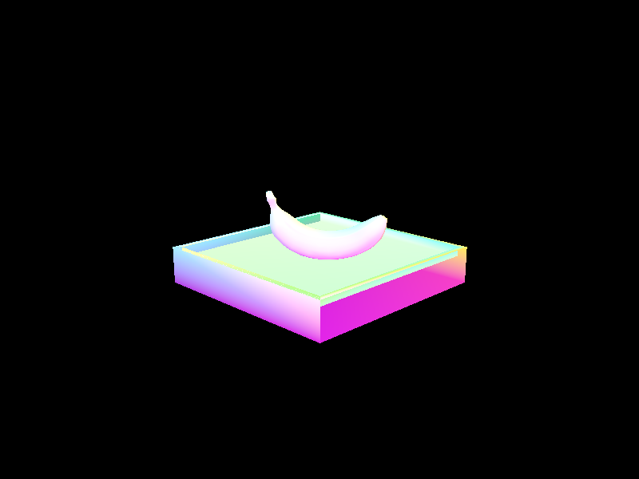
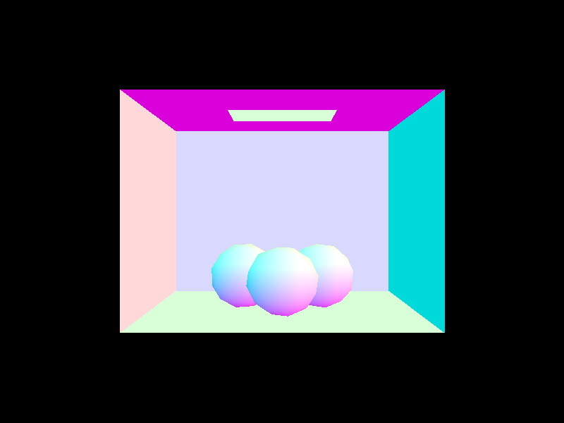
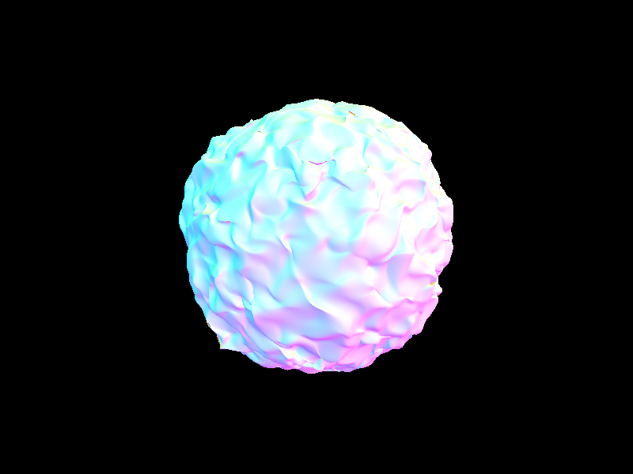
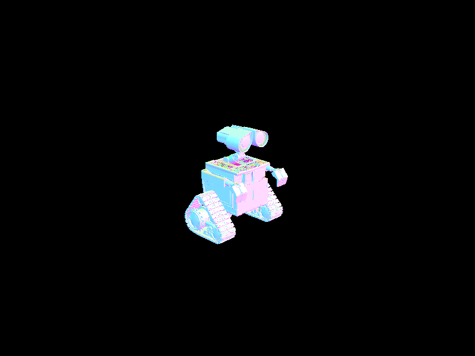
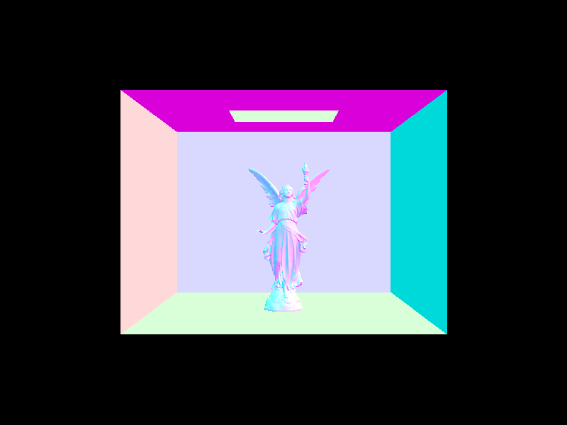
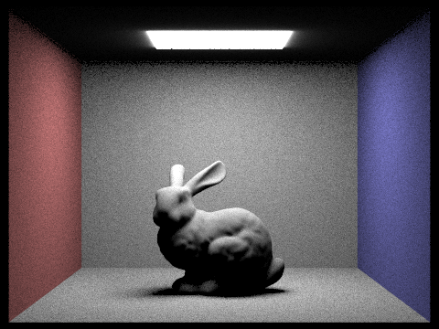
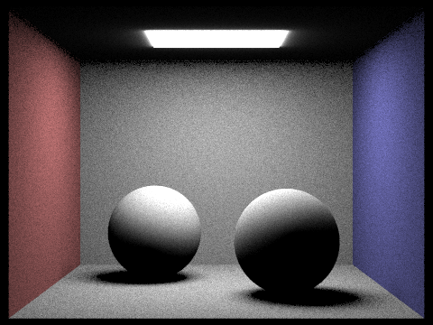
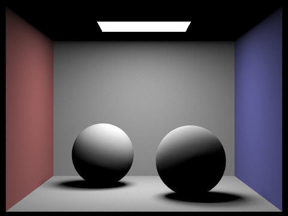

# CS 184: Computer Graphics and Imaging, Spring 2023
# Project 3-1: Path Tracer
## Website URL: todo

## Overview

In this project, we built a working path tracer that renders 3D images by tracing light paths through BVH trees. Recursively tracing light paths allows us to render the scene with global illumination.

## Part 1: Ray Generation and Scene Intersection

### Walk through the ray generation and primitive intersection parts of the rendering pipeline.

Ray generation is one of the first steps in the rendering pipeline. To render the world space onto the camera, we generate rays casting from the camera space to the world space through transformation. The rays are generated by sampling the camera's field of view and the camera's position. To implement ray generation, we place a camera sensor in the world space, whose 2D coordinate in the camera's world space FOV corresponds to the camera space. The normalized difference between the camera point and the sensor is thus the ray direction, with the ray origin being the camera position.

Generated rays are then cast into the world space. For rays that fail to intersect with any primitives, we simply ignore them(on the rendered image they will default to the background color). Rays that intersect with primitives will then proceed in the pipeline, where we calculate the radiance of the intersection point by either directly sampling the light source or by tracing the light path recursively.

### Explain the triangle intersection algorithm you implemented in your own words.

The triangle intersection implementation uses the Moller-Trumbore algorithm. The algorithm works as follows:

1. Calculating the relative edge vectors of the triangle
```cpp
Vector3D e1 = p2 - p1;
Vector3D e2 = p3 - p1;
```
2. Calculating the determinant of the matrix formed by the edge vectors and the ray direction
```cpp
Vector3D s1 = Vector3D::cross(r.d, e2);
float det = Vector3D::dot(s1, e1);
```
3. If the determinant is 0, the ray is parallel to the triangle and there is no intersection
```cpp
if (det == 0) return false;
```
4. We calculate the distance from the ray origin to the first vertex of the triangle
```cpp
float f = 1 / det;
Vector3D s = r.o - p1;
```
5. Then we obtain the barycentric coordinates`b1, b2` of the intersection point
```cpp
...
b1 = f * dot(s, s1); // b1 must be between 0 and 1
b2 = f * dot(r.d, s2); // b2 must be between 0 and 1
...
```
6. Finally, we obtain the time of intersection `t`
```cpp
t = f * dot(e2, s2);
```
Note `t` must be witing the range of the ray's `min_t` and `max_t`. If `t` provides a tighter bound than the current `max_t`, we update the `max_t` to `t` and return `true`, updating the intersection information as well, when the pointer is not null.

### Show images with normal shading for a few small .dae files.
<div align="middle">
  <table style="width:100%">
    <tr align="center">
      <td>
        
        <figcaption>banana.dae</figcaption>
      </td>
      <td>
        
        <figcaption>cow.dae</figcaption>
      </td>
    </tr>
    <tr align="center">
      <td>
        
        <figcaption>sphere.dae</figcaption>
      </td>
      <td>
        
        <figcaption>cbgems.dae</figcaption>
      </td>
    </tr>
  </table>
</div>
<br>

## Part 2: Bounding Volume Hierarchy 

### Walk through your BVH construction algorithm. Explain the heuristic you chose for picking the splitting point.

Out BVH algorithm is a recursive divide algorithm that works on a sorted list. The algorithm works as follows:

1. The caller of `construct_bvh()` passes in a list of primitives sorted by the x coordinate of their centroids. Ties are broken by the y coordinate, then the z coordinate.

2. `construct_bvh` first look at the distance between the `start` and `end` iterators passed to it. If the distance is less than the maximum number of primitives per leaf, we instantiate a leaf node with start and end iterators pointing to the `start` and `end` arguments passed in, returning the node. This is the base case of the recursion where we return a leaf node.

3. Otherwise, we instantiate an internal node. The node's lhs and rhs are assigned to the result of recursively calling `construct_bvh` on the left and right halves of the original list, separated by the average of the x coordinate of the centroids in the list. 

4. When "splitting" the original list, we make sure that we don't assign all elements to either the left or right half, which leads to infinite recursion, since none is reduced. If this happens, we instead use the median of the centroids as the splitting point. This is best illustrated by the following code:
```cpp
double avg_centroid; // avg of centroid on PRED_AXIS axis
.... // calculate avg_centroid
auto comp = [](const Primitive* p, double val) -> bool {
  return p->get_bbox().centroid().PRED_AXIS < val;
};

auto lBegin = a_start;
auto lEnd = std::lower_bound(a_start, a_end, avg_centroid, comp); // binary search to find end of lhs

if (lEnd == lBegin || lEnd == a_end) { // all the primitives on one side
  // in this case, split the lhs/rhs based on the median; since the vec is sorted, simply splitting the vec in 2 will do.
  lEnd = lBegin + size_t(distance(a_start, a_end) / 2);
}
auto rBegin = lEnd;
auto rEnd = a_end;
```

5. After getting the result of recursion, we expand the bounding box of the internal node to include the bounding boxes of its children.

6. Finally, we return the internal node.

### Extra credit portion

Out recursive algorithm works on a sorted vector with 2 pointers. It doesn't create any new vectors on the stack when doing recursive calls, nor does it create any new vectors on the heap to store information for the leaf nodes. In addition, it performs an elegant binary search when looking for the splitting point of the list through `std::lower_bound`, instead of an addition for loop for linear search(ugh). Furthermore, we can altogether eliminate the need for looping through the list by using the median of the centroids of the list, which simply invovles splitting the list in 2 equal halves. 

In conclusion, our BVH algorithm saves both space and time through a 2-pointer approach on a single vector, and a binary search to find the splitting point, with minimum overhead to sort the original list(std::sort is extremely efficient).

### Show images with normal shading for a few large .dae files that you can only render with BVH acceleration.

<div align="middle">
  <table style="width:100%">
    <tr align="center">
      <td>
        
        <figcaption>blob.dae</figcaption>
      </td>
      <td>
        
        <figcaption>wall-e.dae</figcaption>
      </td>
    </tr>
    <tr align="center">
      <td>
        
        <figcaption>lucy.dae</figcaption>
      </td>
      <td>
        
        <figcaption>dragon.dae</figcaption>
      </td>
    </tr>
  </table>
</div>
<br>

### Compare rendering times on a few scenes with moderately complex geometries with and without BVH acceleration. Present your results in a one-paragraph analysis.

The following table compares the rendering times of moderately complex scenes with and without BVH, in seconds:

| Scene | Without BVH | With BVH |
| :---: | :---------: | :------: |
|bunny.dae|75.2498s|0.2415s|
|cow.dae|17.9637s|0.2178s|
|lucy.dae|135.7630s|0.2836s|
|dragon.dae|83.4564s|0.5573s|
|cube.dae|0.1046s|0.0879s|

Image rendering time done with the help of BVH acceleration is significantly faster than without BVH. The difference is especially noticeable when the amount of primitives in the scene is large. This is because BVH allows a binary search to be performed on the primitives with O(log(n)) runtime, compared to the O(n) runtime without BVH. The rendering of `cube.dae`, however, takes less time without BVH than with; this is because the scene is so simple that the BVH construction overhead is not worth the time saved in the traversal.

## Part 3: Direct Illumination 

### Walk through both implementations of the direct lighting function.


#### Hemispheric Lighting

#### Importance Lighting


<div align="middle">
  <table style="width:100%">
    <!-- Header -->
    <tr align="center">
      <th>
        <b>Uniform Hemisphere Sampling</b>
      </th>
      <th>
        <b>Light Sampling</b>
      </th>
    </tr>
    <br>
    <tr align="center">
      <td>
        
        <figcaption>bunny.dae</figcaption>
      </td>
      <td>
        
        <figcaption>bunny.dae</figcaption>
      </td>
    </tr>
    <br>
    <tr align="center">
      <td>
        
        <figcaption>CbSpheres_lambertian.dae</figcaption>
      </td>
      <td>
        
        <figcaption>CbSpheres_lambertian.dae</figcaption>
      </td>
    </tr>
    <br>
  </table>
</div>
<br>
