# CS 184: Computer Graphics and Imaging, Spring 2023
# Project 3-1: Path Tracer
## Website URL: https://github.com/D7ry/cs184-proj-writeup/blob/master/proj3-1/writeup.md

## Overview

In this project, we built a working path tracer that renders 3D images by tracing light paths through BVH trees. Recursively tracing light paths allows us to render the scene with global illumination.

## Part 1: Ray Generation and Scene Intersection

### Walk through the ray generation and primitive intersection parts of the rendering pipeline.

Ray generation is one of the first steps in the rendering pipeline. To render the world space onto the camera, we generate rays casting from the camera space to the world space through transformation. The rays are generated by sampling the camera's field of view and the camera's position. To implement ray generation, we place a camera sensor in the world space, whose 2D coordinate in the camera's world space FOV corresponds to the camera space. The normalized difference between the camera point and the sensor is thus the ray direction, with the ray origin being the camera position.

Generated rays are then cast into the world space. For rays that fail to intersect with any primitives, we simply ignore them(on the rendered image they will default to the background color). Rays that intersect with primitives will then proceed in the pipeline, where we calculate the radiance of the intersection point by either directly sampling the light source or by tracing the light path recursively.

### Explain the triangle intersection algorithm you implemented in your own words.

The triangle intersection implementation uses the Moller-Trumbore algorithm. The algorithm works as follows:

1. Calculating the relative edge vectors of the triangle
```cpp
Vector3D e1 = p2 - p1;
Vector3D e2 = p3 - p1;
```
2. Calculating the determinant of the matrix formed by the edge vectors and the ray direction
```cpp
Vector3D s1 = Vector3D::cross(r.d, e2);
float det = Vector3D::dot(s1, e1);
```
3. If the determinant is 0, the ray is parallel to the triangle and there is no intersection
```cpp
if (det == 0) return false;
```
4. We calculate the distance from the ray origin to the first vertex of the triangle
```cpp
float f = 1 / det;
Vector3D s = r.o - p1;
```
5. Then we obtain the barycentric coordinates`b1, b2` of the intersection point
```cpp
...
b1 = f * dot(s, s1); // b1 must be between 0 and 1
b2 = f * dot(r.d, s2); // b2 must be between 0 and 1
...
```
6. Finally, we obtain the time of intersection `t`
```cpp
t = f * dot(e2, s2);
```
Note `t` must be witing the range of the ray's `min_t` and `max_t`. If `t` provides a tighter bound than the current `max_t`, we update the `max_t` to `t` and return `true`, updating the intersection information as well, when the pointer is not null.

### Show images with normal shading for a few small .dae files.
<div align="middle">
  <table style="width:100%">
    <tr align="center">
      <td>
        
        <figcaption>banana.dae</figcaption>
      </td>
      <td>
        
        <figcaption>cow.dae</figcaption>
      </td>
    </tr>
    <tr align="center">
      <td>
        
        <figcaption>sphere.dae</figcaption>
      </td>
      <td>
        
        <figcaption>cbgems.dae</figcaption>
      </td>
    </tr>
  </table>
</div>
<br>

## Part 2: Bounding Volume Hierarchy 

### Walk through your BVH construction algorithm. Explain the heuristic you chose for picking the splitting point.

Out BVH algorithm is a recursive divide algorithm that works on a sorted list. The algorithm works as follows:

1. The caller of `construct_bvh()` passes in a list of primitives sorted by the x coordinate of their centroids. Ties are broken by the y coordinate, then the z coordinate.

2. `construct_bvh` first look at the distance between the `start` and `end` iterators passed to it. If the distance is less than the maximum number of primitives per leaf, we instantiate a leaf node with start and end iterators pointing to the `start` and `end` arguments passed in, returning the node. This is the base case of the recursion where we return a leaf node.

3. Otherwise, we instantiate an internal node. The node's lhs and rhs are assigned to the result of recursively calling `construct_bvh` on the left and right halves of the original list, separated by the average of the x coordinate of the centroids in the list. 

4. When "splitting" the original list, we make sure that we don't assign all elements to either the left or right half, which leads to infinite recursion, since none is reduced. If this happens, we instead use the median of the centroids as the splitting point. This is best illustrated by the following code:
```cpp
double avg_centroid; // avg of centroid on PRED_AXIS axis
.... // calculate avg_centroid
auto comp = [](const Primitive* p, double val) -> bool {
  return p->get_bbox().centroid().PRED_AXIS < val;
};

auto lBegin = a_start;
auto lEnd = std::lower_bound(a_start, a_end, avg_centroid, comp); // binary search to find end of lhs

if (lEnd == lBegin || lEnd == a_end) { // all the primitives on one side
  // in this case, split the lhs/rhs based on the median; since the vec is sorted, simply splitting the vec in 2 will do.
  lEnd = lBegin + size_t(distance(a_start, a_end) / 2);
}
auto rBegin = lEnd;
auto rEnd = a_end;
```

5. After getting the result of recursion, we expand the bounding box of the internal node to include the bounding boxes of its children.

6. Finally, we return the internal node. Note that we return the leaf node earlier on base case.

### Extra credit portion

Out recursive algorithm works on a sorted vector with 2 pointers. It doesn't create any new vectors on the stack when doing recursive calls, nor does it create any new vectors on the heap to store information for the leaf nodes. In addition, it performs an elegant binary search when looking for the splitting point of the list through `std::lower_bound`, instead of an addition for loop for linear search(ugh). Furthermore, we can altogether eliminate the need for looping through the list by using the median of the centroids of the list, which simply invovles splitting the list in 2 equal halves. 

In conclusion, our BVH algorithm saves both space and time through a 2-pointer approach on a single vector, and a binary search to find the splitting point, with minimum overhead to sort the original list(std::sort is extremely efficient).

### Show images with normal shading for a few large .dae files that you can only render with BVH acceleration.

<div align="middle">
  <table style="width:100%">
    <tr align="center">
      <td>
        
        <figcaption>blob.dae</figcaption>
      </td>
      <td>
        
        <figcaption>wall-e.dae</figcaption>
      </td>
    </tr>
    <tr align="center">
      <td>
        
        <figcaption>lucy.dae</figcaption>
      </td>
      <td>
        
        <figcaption>dragon.dae</figcaption>
      </td>
    </tr>
  </table>
</div>
<br>

### Compare rendering times on a few scenes with moderately complex geometries with and without BVH acceleration. Present your results in a one-paragraph analysis.

The following table compares the rendering times of moderately complex scenes with and without BVH, in seconds:

| Scene | Without BVH | With BVH |
| :---: | :---------: | :------: |
|bunny.dae|75.2498s|0.2415s|
|cow.dae|17.9637s|0.2178s|
|lucy.dae|135.7630s|0.2836s|
|dragon.dae|83.4564s|0.5573s|
|cube.dae|0.1046s|0.0879s|

Image rendering time done with the help of BVH acceleration is significantly faster than without BVH. The difference is especially noticeable when the amount of primitives in the scene is large. This is because BVH allows a binary search to be performed on the primitives with O(log(n)) runtime, compared to the O(n) runtime without BVH. The rendering of `cube.dae`, however, takes less time without BVH than with; this is because the scene is so simple that the BVH construction overhead is not worth the time saved in the traversal.

## Part 3: Direct Illumination 

### Walk through both implementations of the direct lighting function.

#### Hemispheric Lighting

The hemispheric lighting implementation samples random points on the hemisphere centered at the intersection point between the ray and the primitive, whose normal is used as the hemisphere's axis: 
```cpp
Vector3D wi_sample hemisphereSampler->get_sample();
```
Additional rays are then cast from the intersection point to the hemisphere points. If the ray intersects with any primitive, we add the contribution of the light to the color of the intersection point, using the Monte Carlo integration method:
```cpp
if (bvh->intersect(r, &i_isect)) {
  CGL::Vector3D lighting = i_isect.bsdf->get_emission() * isect.bsdf->f(w_out, wi_sample) * wi_sample.z;
  L_out += lighting;
  // wi_sample.z is the cosine
}
```
Once we sample `num_samples` rays, we divide the accumulated lighting by `num_samples` to get the average lighting; in addition, we multiply the lighting by `2*PI` as the probability of sampling a point on the hemisphere is `1/(2*PI)`. We delay this multiplication to the end to save performance.

#### Importance Lighting

Instead of casting random rays from the intersection, importance lighting impl samples light sources in the existing scene, casting rays from the light source to the intersection point. Similarly, the light is then added to the color of the intersection point using the Monte Carlo integration method:

The following steps demonstrate a single pass of the importance lighting algorithm, performed on a single light source:

First, determine how many samples to perform on the light source. If the light source is a delta light, we don't need to sample it multiple times, as the light is only emitted from a single point.
```cpp
int sample_rep = light->is_delta_light() ? 1 : ns_area_light;
```

Then, sample `samlpe_rep` amount of rays and accumulate the lighting:
```cpp
Vector3D light_sample_avg = Vector3D(0.0);
for (int i = 0; i < sample_rep; i++) {
  Vector3D sample_light = light->sample_L(hit_p, &wi, &distToLight, &pdf);
  Ray r = Ray(hit_p, wi, distToLight - EPS_F);
  r.min_t = EPS_F;
  Intersection sample_intersect;
}
```

Note that here, the light source contributes to the intersection point only when no other primitives is in between them:

```cpp
if (!bvh->intersect(r, &sample_intersect)) {					
  light_sample_avg +=  // your fav monte carlo integration
    (isect.bsdf->f(w_out, w2o * wi)
    * sample_light
    * (w2o * wi).z)
      / pdf;
}
light_sample_avg /= sample_rep;
```

Finally, we average out the lighting from all light sources
```cpp
L_out /= scene->lights.size();
```

### Show some images rendered with both implementations of the direct lighting function.
<div align="middle">
  <table style="width:100%">
    <tr align="center">
      <th>
        <b>Uniform Hemisphere Sampling</b>
      </th>
      <th>
        <b>Light Sampling</b>
      </th>
    </tr>
    <br>
    <tr align="center">
      <td>
        
        <figcaption>bunny.dae</figcaption>
      </td>
      <td>
        
        <figcaption>bunny.dae</figcaption>
      </td>
    </tr>
    <br>
    <tr align="center">
      <td>
        
        <figcaption>CbSpheres_lambertian.dae</figcaption>
      </td>
      <td>
        
        <figcaption>CbSpheres_lambertian.dae</figcaption>
      </td>
    </tr>
    <br>
  </table>
</div>
<br>

### Focus on one particular scene with at least one area light and compare the noise levels in soft shadows when rendering with 1, 4, 16, and 64 light rays (the -l flag) and with 1 sample per pixel (the -s flag) using light sampling, not uniform hemisphere sampling.

<div align="middle">
  <table style="width:100%">
    <tr align="center">
      <td>
        
        <figcaption>1 Light Ray (CBbunny.dae)</figcaption>
      </td>
      <td>
        
        <figcaption>4 Light Rays (CBbunny.dae)</figcaption>
      </td>
    </tr>
    <tr align="center">
      <td>
        
        <figcaption>16 Light Rays (CBbunny.dae)</figcaption>
      </td>
      <td>
        
        <figcaption>64 Light Rays (CBbunny.dae)</figcaption>
      </td>
    </tr>
  </table>
</div>

The noise level in soft shadows is significantly more noticeable at lower light ray count, and has been greatly reduced at higher light ray counts. This is because the areas supposed to be in soft shadow are much less likely to be in direct contact with the light rays cast from a point sampled from area lights. 

For example, when we only sample 1 light ray from the whole area light, chances are that the light ray is going to be occluded by the bunny. Even if the light ray hits the soft shadow area, the contribution of light from this one hit will account for the entire lighting of the hit point, leading to a soft shadow area that is much more noisy and not as smooth.

### Compare the results between uniform hemisphere sampling and lighting sampling in a one-paragraph analysis.

Visually, lighting sampling produces much less noise under the same sampling configuration. This is because lighting sampling directly samples from the light source and the sampled lights are more likely to hit the point. Lighting sampling also works for point lights, whereas for universal hemispheric sampling, we need an infinite number of samples to get a good approximation of the light source. Notably, both algorithms provide an unbiased approximation of the lighting under large sample counts.


## Part 4: Global Illumination

### Walk through your implementation of the indirect lighting function.

Our implementation of indirect lightning function involves a recursive algorithm terminated by either maximum ray depth or the Russian Roulette method. The algorithm is as follows, implemented in `PathTracer::at_least_one_bounce_radiance` that calculates the radiance at `isect` intersected with ray `r`:

1. We calculate the one-bounce radiance using our implementation of direct illumination in part 3:
```cpp
L_out += one_bounce_radiance(r, isect);
```
2. Then, we'll check if it's time to terminate the recursion(at base case or Russian Roulette):
```cpp
if (bang() || r.depth == 1) { return L_out;}
```

3. If it's not yet time to end the recursion, we cast a random ray from the intersection point; first we set up the ray:
```cpp
Vector3D next_wi; double next_pdf; Intersection next_isect;
Vector3D next_rad = isect.bsdf->sample_f(w_out, &next_wi, &next_pdf);
Ray next_r = Ray(hit_p, o2w * next_wi, INF_D, r.depth - 1);
next_r.min_t = EPS_F;
```
`sample_f` stores a random direction into `next_wi` and the probability of sampling that direction into `next_pdf`. 

4. Next, we try to cast the ray and, on ray hit, we recursively call the function to accumulate the radiance at the new hit point:
```cpp
if (bvh->intersect(next_r, &next_isect)) {
  Vector3D next_L = at_least_one_bounce_radiance(next_r, next_isect); // invoke recursion
  L_out += next_L * next_rad * next_wi.z / next_pdf / RL_CHANCE;
}
```
at the end, L_out is divided by `RL_CHANCE` and `next_pdf`(if bvh intersects)to normalize the Russian roulette and sampling probabilities. 

Since we reduce the ray depth on every new recursion, the recursion will terminate when the ray depth is 0, the Russian roulette ends the recursion, or the ray misses the scene. We can then safely assume that recursively calling `at_least_one_bounce_radiance` will return the radiance at the new hit point, which we then add to the current radiance.

One special case is when the ray trace depth is set to 0, in which we simply return a 0 vector at the beginning of the function.
```cpp
if (r.depth == 0) return Vector3D(0, 0, 0);
```

This implementation guarantees to accumulate at least one bounce lighting for radiance >= 1.


### Show some images rendered with global (direct and indirect) illumination. Use 1024 samples per pixel.

<div align="middle">
  <table style="width:100%">
    <tr align="center">
      <td>
        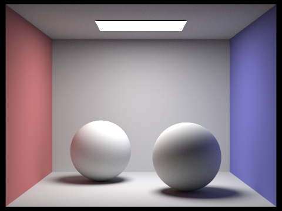
        <figcaption>CBspheres_lambertian.dae</figcaption>
      </td>
      <td>
        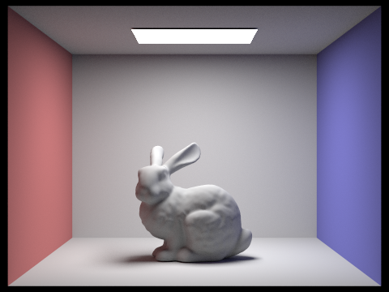
        <figcaption>CbBunny.dae</figcaption>
      </td>
    </tr>
  </table>
</div>
<br>

**Note:** the above images have Russian roulette chance set to 1.0, meaning the recursion does not randomly terminate. The following images, however, are rendered with Russian roulette chance set to 0.4.

### Pick one scene and compare rendered views first with only direct illumination, then only indirect illumination. Use 1024 samples per pixel. (You will have to edit PathTracer::at_least_one_bounce_radiance(...) in your code to generate these views.)

<div align="middle">
  <table style="width:100%">
    <tr align="center">
      <td>
        
        <figcaption>Only direct illumination (example1.dae)</figcaption>
      </td>
      <td>
        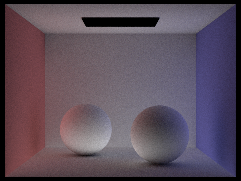
        <figcaption>Only indirect illumination (example1.dae)</figcaption>
      </td>
    </tr>
  </table>
</div>

To achieve only indirect illumination, we prevent the algorithm from accumulating light when the ray depth is equal to maximum ray depth(i.e. start of recursion). We also comment out the zero_bounce_radiance function in est_radiance_global_illumination so the ceiling don't emit zero bounce lighting.

Both image produce interesting result. When we render with only direct illumination, there is no bounce lighting, the ceiling and shaded areas of the balls are completely black. When we render with only indirect illumination, the ceiling is lit up by the light bounced up from the balls and the walls, and the balls' shaded areas are brighter than areas directly exposed to the light source. Intuitively, this happens because light directly reaching exposed areas are blocked by the algorithm, so the shaded areas turn out to be better lit. There is much more red and blue-ness on either sides of the balls, as they're lit primarily by the bounce lighting from the walls.

### For CBbunny.dae, compare rendered views with max_ray_depth set to 0, 1, 2, 3, and 100 (the -m flag). Use 1024 samples per pixel.

<div align="middle">
  <table style="width:100%">
    <tr align="center">
      <td>
        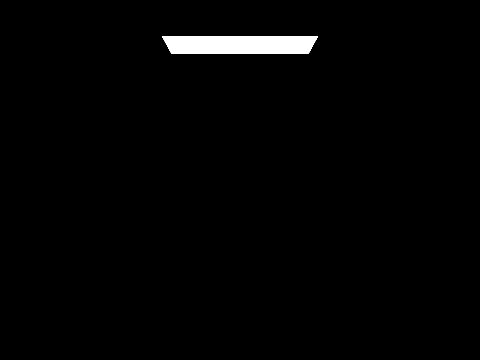
        <figcaption>max_ray_depth = 0 (CBbunny.dae)</figcaption>
      </td>
      <td>
        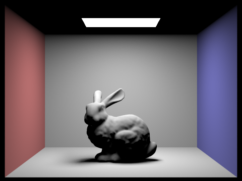
        <figcaption>max_ray_depth = 1 (CBbunny.dae)</figcaption>
      </td>
    </tr>
    <tr align="center">
      <td>
        
        <figcaption>max_ray_depth = 2 (CBbunny.dae)</figcaption>
      </td>
      <td>
        
        <figcaption>max_ray_depth = 3 (CBbunny.dae)</figcaption>
      </td>
    </tr>
    <tr align="center">
      <td>
        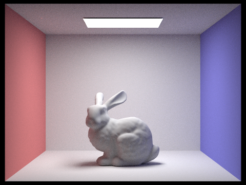
        <figcaption>max_ray_depth = 100 (CBbunny.dae)</figcaption>
      </td>
    </tr>
  </table>
</div>

When max_ray_depth is 0 or 1, the render result is the same as 0-bounce and 1-bounce direct lighting. For max_ray_depth of 2 and above, the images start showing more and more subtle indirect(bounce) lighting. For example, the ceiling is lit by the bounce light from the floor as well as two walls, resulting in a tinge of red and blue on its either side(same as the rabbit). In addition, the rabbit's soft shadow becomes more smooth, a result of bounce-lighting from the walls, the rabbit itself, and the floor. The aforementioned subtlety is more apparent with higher max_ray_depth. Notably, however, global path tracing introduces some noise; this issue can be addressed by either increasing the Russian roulette survival rate(as demonstrated in the first 2 images with the survival rate set to 1.0), increasing the number of samples per pixel, or the adaptive sampling technique discussed in the next section.

### Pick one scene and compare rendered views with various sample-per-pixel rates, including at least 1, 2, 4, 8, 16, 64, and 1024. Use 4 light rays.

<div align="middle">
  <table style="width:100%">
    <tr align="center">
      <td>
        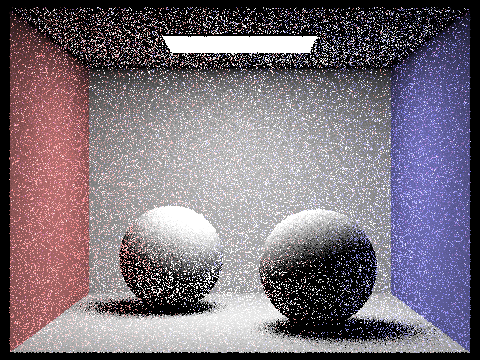
        <figcaption>1 sample per pixel (CBSpheres_lambertian.dae)</figcaption>
      </td>
      <td>
        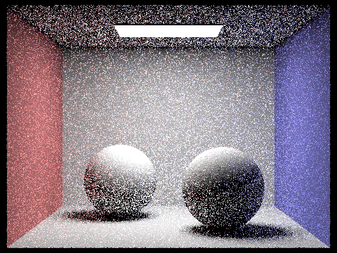
        <figcaption>2 samples per pixel (CBSpheres_lambertian.dae)</figcaption>
      </td>
    </tr>
    <tr align="center">
      <td>
        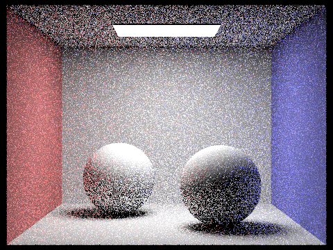
        <figcaption>4 samples per pixel (CBSpheres_lambertian.dae)</figcaption>
      </td>
      <td>
        
        <figcaption>8 samples per pixel (CBSpheres_lambertian.dae)</figcaption>
      </td>
    </tr>
    <tr align="center">
      <td>
        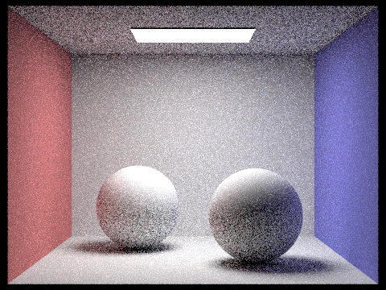
        <figcaption>16 samples per pixel (CBSpheres_lambertian.dae)</figcaption>
      </td>
      <td>
        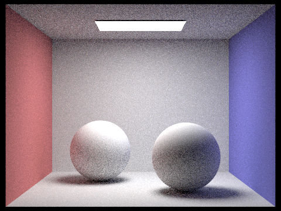
        <figcaption>64 samples per pixel (CBSpheres_lambertian.dae)</figcaption>
      </td>
    </tr>
    <tr align="center">
      <td>
        
        <figcaption>1024 samples per pixel (CBSpheres_lambertian.dae)</figcaption>
      </td>
    </tr>
  </table>
</div>

Lower sample-per-pixel rates feature more "white" noise, where the color of the pixel is not consistent with its neighbors. The "white" noise gets smaller and more sparse as per pixel rates get large. This is because the sample rate is too small to evaluate a good average of lighting. Take the sides of the spheres, for example. The left and right sides of spheres in images with small sample rates are either completely dark or completely red/blue; for images with higher sample rates, the path tracer can collect bounce lighting from all directions and make a consistent average, whereas lower sample rates can only collect bounce lighting from a few directions.

## Part 5: Adaptive Sampling

### Explain adaptive sampling. Walk through your implementation of the adaptive sampling.

Ray-tracing through Monte-Carlo integration is very costly with large sample rate. Adaptive sampling reduces the cost of ray-tracing by sampling less the pixels that converge faster(i.e. less noise-prone). For example, adaptive sampling samples more the soft-shadow area of the previous rabbit image.

Our implementation of adaptive sampling is a simple code snippet added in `PathTracer::raytrace_pixel()` function. We check the relationship between the standard deviation of total illumination, number of samples, and the `maxTolerance` variable, by combining them into a an `I` value.

For every `samplePerBatch` samples, the following code snippet is executed:
```cpp
double n = i + 1; // how many samples we have so far
double variance = (1.f / (n - 1.f)) * (s2 - (s1 * s1 / n));
double sd = sqrt(variance);
double mean = s1 / n;
double I = 1.96 * sd / std::sqrt(n);
if (I <= (maxTolerance * mean)) {
  break;
}
```
The 1.96 comes from the 95% confidence interval. The check intuitively makes sense, as we want either the standard deviation to be small or the number of samples to be large.

In addition, we accumulate `s1` and `s2` for the standard deviation calculation for every sample:
```cpp
float illuym = est_radiance_global_illumination(sample_ray).illum();
s1 += illuym;
s2 += illuym * illuym;
```

Adaptive sampling allows us to focus on noisy pixels. The following images show the result of adaptive sampling as well as the sample rate illustrated by the color warmth.


### Pick two scenes and render them with at least 2048 samples per pixel. Show a good sampling rate image with clearly visible differences in sampling rate over various regions and pixels. Include both your sample rate image, which shows your how your adaptive sampling changes depending on which part of the image you are rendering, and your noise-free rendered result. Use 1 sample per light and at least 5 for max ray depth.

<div align="middle">
  <table style="width:100%">
    <tr align="center">
      <td>
        
        <figcaption>Rendered image (bunny.dae)</figcaption>
      </td>
      <td>
        
        <figcaption>Sample rate image (bunny.dae)</figcaption>
      </td>
    </tr>
    <tr align="center">
      <td>
        
        <figcaption>Rendered image (sphere_lambertian.dae)</figcaption>
      </td>
      <td>
        
        <figcaption>Sample rate image (sphere_lambertian.dae)</figcaption>
      </td>
    </tr>
  </table>
</div>

In the above images, the sampling rate is clearly higher in soft-shadow areas. This makes sense since the soft-shadow area is more noise-prone and requires more samples to converge. In comparison, areas with no shadows, for example, the walls, requires far less sample as illustrated by the cold colors in the sample rate image.