url: https://github.com/D7ry/cs184-proj-writeup/blob/master/proj3-2/writeup.md

# Assignment 3-2: Additional Features to PathTracer

* NOTE: For this project, you will choose TWO out of the four given parts to complete. One of those parts must be Part 1 or Part 2. In other words, you can choose any combination of two parts except the pair (Part 3, Part 4).

## Part 1. Mirror and Glass Materials

### Show a sequence of six images of scene `CBspheres.dae` rendered with `max_ray_depth` set to 0, 1, 2, 3, 4, 5, and 100. The other settings should be at least 64 samples per pixel and 4 samples per light. Make sure to include all screenshots.

<body>
    <table>
      <tr>
        <td>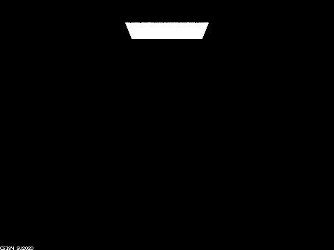</td>
        <td>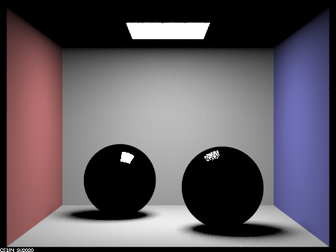</td>
        <td>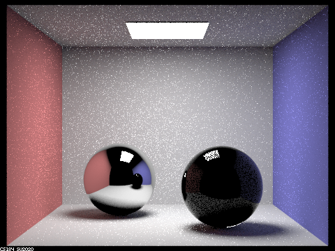</td>
      </tr>
      <tr>
        <td>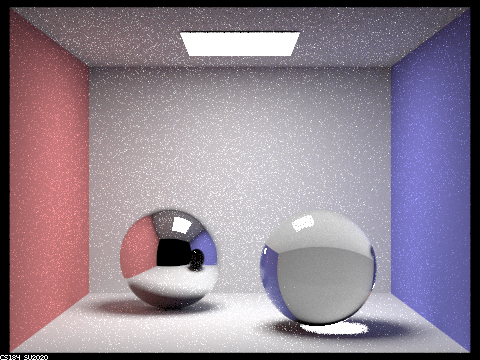</td>
        <td>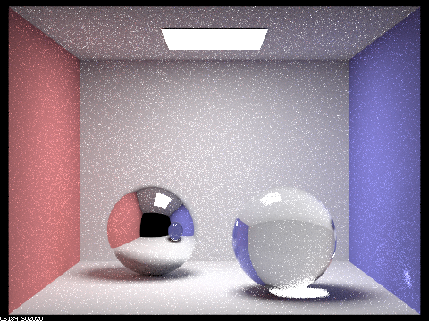</td>
        <td>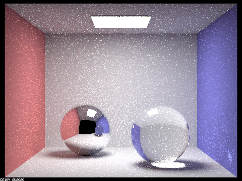</td>
      </tr>
	  <tr>
	  	<td>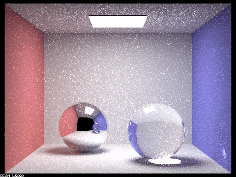</td>
    </table>
  </body>

### Point out the new multibounce effects that appear in each image, and Explain how these bounce numbers relate to the particular effects that appear.
- max_ray_depth = 0: darkness
- max_ray_depth = 1: direct lighting on the cvb, and reflection of light source from both glass and mirror ball as light bounces once.
- max_ray_depth = 2: bounce lighting that lit up the ceiling and softens shadows, reflections of cvb on both balls as light is abounce to bounce on the actual reflective surface.
- max_ray_depth = 3: more bounce lighting. Refracted light by the glass ball that lit up the originally shadowed area and itself. Reflected light by the reflected glass ball in the mirror ball.
- max_ray_depth = 4: more bounce lighting. Refracted light by the glass ball residing in the mirror ball that lit itself as well as the reflected floor up. Bounce lighting from the floor that lit up the glass ball's bottom.
- max_ray_depth = 5: more bounce lighting. Bounce lighting in the mirror ball's cvb from the floor that lit up the glass ball(in the mirror ball)'s bottom, as a result of ray being able to enter and exit the glass ball(very cool stuff).
- max_ray_depth = 100: more subtle bounce lighting. If you look really close you can see the light being bounced back and forth between the balls, the walls, and being refracted by the glass ball. For example the red tinge on the glass ball's right side.

## Part 4. Depth of Field

### In a few sentences, explain the differences between a pinhole camera model and a thin-lens camera model.

The pinhole camera model assumes all light rays pass through a pinhole, projecting an inverted image onto an image plane(camera space). Therefore it is unable to simulate camera effects such as dof and len distortion.

The thin-lens camera model assumes that lights pass through a thin len and then is focused onto the image plane. This model allows the renderer to simulate camera effects such as dof and len distortion.

### Show a "focus stack" where you focus at 4 visibly different depths through a scene. Make sure to include all screenshots.

The following images have incrementing focus distances from 4.5 to 5.1, 0.2 at a time. 

<html>
  <body>
    <table>
      <tr>
        <td>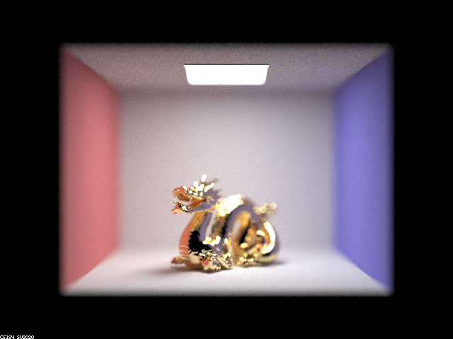</td>
        <td>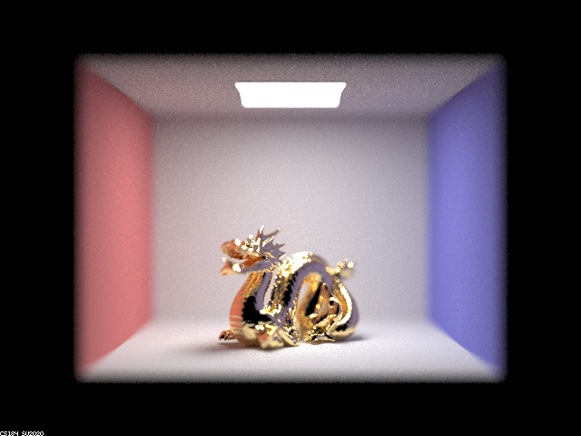</td>
      </tr>
      <tr>
        <td>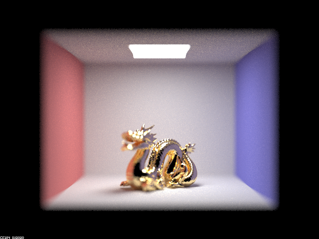</td>
        <td></td>
      </tr>
    </table>
  </body>
</html>

### Show a sequence of 4 pictures with visibly different aperture sizes, all focused at the same point in a scene. Make sure to include all screenshots.

The following images have incrementing aperture sizes from 0.11 to 0.29, incrementing by 0.06 at a time.

<html>
  <body>
    <table>
      <tr>
        <td></td>
        <td>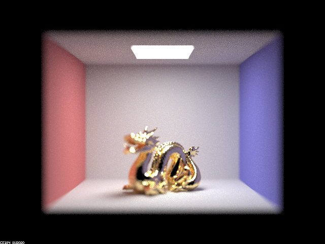</td>
      </tr>
      <tr>
        <td></td>
        <td>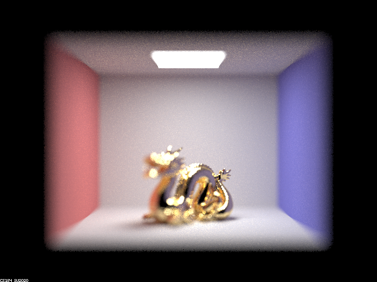</td>
      </tr>
    </table>
  </body>
</html>
