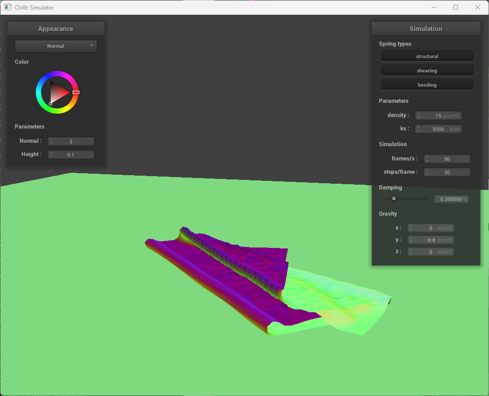

# CS 184: Computer Graphics and Imaging, Spring 2023
# Project 4: Cloth Simulator

## Overview

In this project, we built a cloth simulator using the mass-spring system that supports self-collision, object-collision, and shaders. This project is really cool.

## Part I: Masses and Springs

### Take some screenshots of scene/pinned2.json from a viewing angle where you can clearly see the cloth wireframe to show the structure of your point masses and springs.
<table>
  <tr>
    <td align="center"></td>
    <td align="center"></td>
  </tr>
</table>

### Show us what the wireframe looks like (1) without any shearing constraints, (2) with only shearing constraints, and (3) with all constraints.
<table>
  <tr>
    <td align="center">
	
	        <figcaption>without shearing constraints</figcaption>
	</td>
    <td align="center">
	
	        <figcaption>with only shearing constraint</figcaption>
	</td>
	<td align="center">
	
	        <figcaption>with all constraints</figcaption>
	</td>
  </tr>
</table>

## Part II: Simulation via numerical integration

### Describe the effects of changing the spring constant ks; how does the cloth behave from start to rest with a very low ks? A high ks?

Ks determines the stiffness of the springs. A really low ks makes the cloth very loose and the cloth sags a lot. A high ks makes the cloth very stiff, and as a result, more resistant to external forces. Visually, the cloth is more "crisp" with a high ks.

<table>
  <tr>
    <td align="center">
	
	        <figcaption>Small ks</figcaption>
	</td>
    <td align="center">
	
	        <figcaption>Default ks</figcaption>
	</td>
	<td align="center">
	
	        <figcaption>Big ks</figcaption>
	</td>
  </tr>
</table>

With big ks, the cloth seems to be extremely tight that it tries to pull itself together. This reminds me balloons.

### What about for density?

Density changes the cloth's mass per unit and therefore, inertia and resistance to external forces. A higher density makes the cloth heavier and more resistant to external forces, making it harder to move around; the cloth also tend to sag more. A lower density makes the cloth lighter and more susceptible to external forces, making it easier to move around; the cloth also tends to sag less.

<table>
  <tr>
    <td align="center">
	
	        <figcaption>Low density</figcaption>
	</td>
    <td align="center">
	
	        <figcaption>Default density</figcaption>
	</td>
	<td align="center">
	
	        <figcaption>High density</figcaption>
	</td>
  </tr>
</table>

With low density, the cloth appears to be visually lighter too since it sags much less. It makes the viewer feel as if less force is pulling the cloth down.

### What about for damping?

Damping determines the amount of energy loss for each simulation. A higher damping makes the cloth lose energy faster, making it less likely to oscillate. A lower damping makes the cloth lose energy slower, making it more likely to oscillate, i.e. more dynamic yet less stable.

<table>
  <tr>
    <td align="center">
	
	        <figcaption>Low damping</figcaption>
	</td>
    <td align="center">
	
	        <figcaption>Default damping</figcaption>
	</td>
	<td align="center">
	
	        <figcaption>High damping</figcaption>
	</td>
  </tr>
</table>

The images above are taken 1 second into the simulation. With damping set to zero, the cloth oscillates a lot; with higher damping values, the cloth oscillates a lot less and stops really quickly, with gravity being the only force that pulls the cloth down.

### For each of the above, observe any noticeable differences in the cloth compared to the default parameters and show us some screenshots of those interesting differences and describe when they occur.

see above.

### Show us a screenshot of your shaded cloth from scene/pinned4.json in its final resting state! If you choose to use different parameters than the default ones, please list them.

<table>
  <tr>
    <td align="center"></td>
	<figcaption>Final state of pinned4.json</figcaption>
  </tr>
</table>

## Part III: Handling collisions with other objects
### Show us screenshots of your shaded cloth from scene/sphere.json in its final resting state on the sphere using the default ks = 5000 as well as with ks = 500 and ks = 50000. Describe the differences in the results.

<table>
  <tr>
    <td align="center">
	
	        <figcaption>ks = 500</figcaption>
	</td>
    <td align="center">
	
	        <figcaption>ks = 5000</figcaption>
	</td>
	<td align="center">
	
	        <figcaption>ks = 50000</figcaption>
	</td>
  </tr>
</table>

Simulations with lower ks appears to be less stiff and more soggy. The cloth drapes more loosely on the sphere. Simulations with high ks(50000) looks very stiff and crisp, and the cloth drapes very tightly on the sphere, with most part "folding" together on one of the 4 sides, with much fewer folds.

### Show us a screenshot of your shaded cloth lying peacefully at rest on the plane. If you haven't by now, feel free to express your colorful creativity with the cloth! (You will need to complete the shaders portion first to show custom colors.)

## Part IV: Handling self-collisions

### Show us at least 3 screenshots that document how your cloth falls and folds on itself, starting with an early, initial self-collision and ending with the cloth at a more restful state (even if it is still slightly bouncy on the ground).

<table>
  <tr>
    <td align="center">
	
	</td>
    <td align="center">
	
	</td>
	<td align="center">
	
	</td>
  </tr>
</table>

### Vary the density as well as ks and describe with words and screenshots how they affect the behavior of the cloth as it falls on itself.

Higher density makes the cloth heavier, and it tends to collapse onto itself more, lower density makes the cloth lighter and it tends to spread out more. The fold is also more pronounced with higher density.

<table>
  <tr>
    <td align="center">
	
		        <figcaption>low density</figcaption>
	</td>
    <td align="center">
	
			        <figcaption>default density</figcaption>
	</td>
	<td align="center">
	
				        <figcaption>high density</figcaption>
	</td>
  </tr>
</table>

Variation in ks affects the speed of the cloth's collapse. Higher ks makes the cloth collapse faster, lower ks makes the cloth collapse slower, as the cloth has less force to pull itself together. The following 3 images are taken 5 seconds into the simulation; cloth with higher ks appears to be "folding" more quickly and looks more "crisp" due to the more pronounced folds as a result of the higher ks. Cloth with low ks looks as if it's having a hard time pulling itself together.

<table>
  <tr>
    <td align="center">
	
		        <figcaption>low ks</figcaption>
	</td>
    <td align="center">
	
			        <figcaption>default ks</figcaption>
	</td>
	<td align="center">
	
				        <figcaption>high ks</figcaption>
	</td>
  </tr>
</table>

## Part V: Shaders