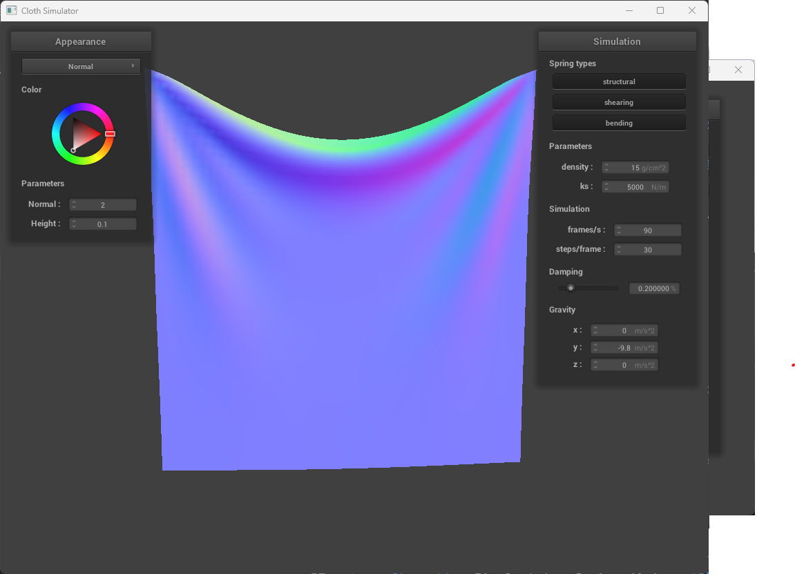
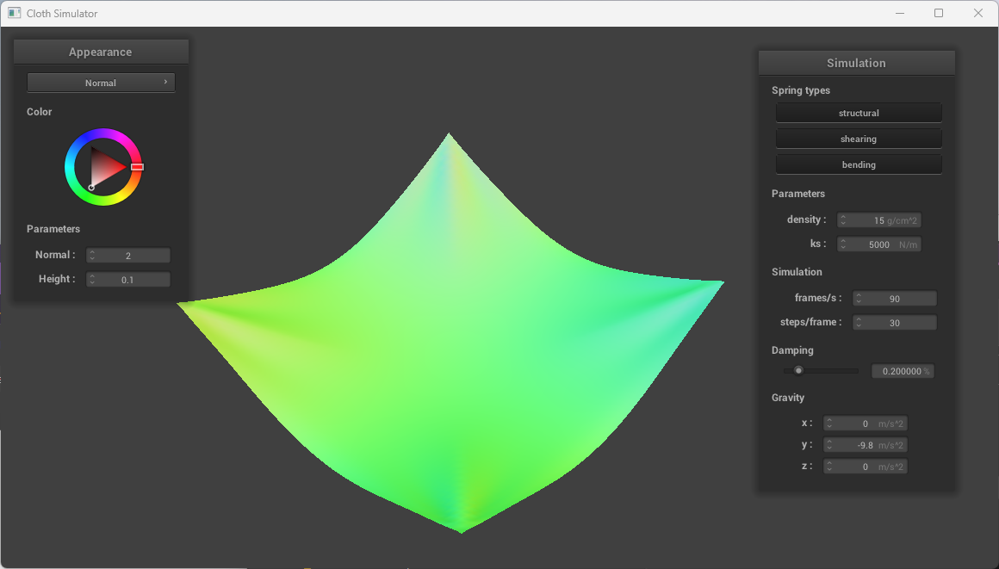

# CS 184: Computer Graphics and Imaging, Spring 2023
# Project 4: Cloth Simulator

## Overview

In this project, we built a cloth simulator using the mass-spring system that supports self-collision, object-collision, and shaders. This project is really cool.

## Part I: Masses and Springs

### Take some screenshots of scene/pinned2.json from a viewing angle where you can clearly see the cloth wireframe to show the structure of your point masses and springs.
<table>
  <tr>
    <td align="center"></td>
    <td align="center"></td>
  </tr>
</table>

### Show us what the wireframe looks like (1) without any shearing constraints, (2) with only shearing constraints, and (3) with all constraints.
<table>
  <tr>
    <td align="center">
	
	        <figcaption>without shearing constraints</figcaption>
	</td>
    <td align="center">
	
	        <figcaption>with only shearing constraint</figcaption>
	</td>
	<td align="center">
	
	        <figcaption>with all constraints</figcaption>
	</td>
  </tr>
</table>

## Part II: Simulation via numerical integration

### Describe the effects of changing the spring constant ks; how does the cloth behave from start to rest with a very low ks? A high ks?

Ks determines the stiffness of the springs. A really low ks makes the cloth very loose and the cloth sags a lot. A high ks makes the cloth very stiff, and as a result, more resistant to external forces. Visually, the cloth is more "crisp" with a high ks.

<table>
  <tr>
    <td align="center">
	
	        <figcaption>Small ks</figcaption>
	</td>
    <td align="center">
	
	        <figcaption>Default ks</figcaption>
	</td>
	<td align="center">
	
	        <figcaption>Big ks</figcaption>
	</td>
  </tr>
</table>

With big ks, the cloth seems to be extremely tight that it tries to pull itself together. This reminds me balloons.

### What about for density?

Density changes the cloth's mass per unit and therefore, inertia and resistance to external forces. A higher density makes the cloth heavier and more resistant to external forces, making it harder to move around; the cloth also tend to sag more. A lower density makes the cloth lighter and more susceptible to external forces, making it easier to move around; the cloth also tends to sag less.

<table>
  <tr>
    <td align="center">
	
	        <figcaption>Low density</figcaption>
	</td>
    <td align="center">
	
	        <figcaption>Default density</figcaption>
	</td>
	<td align="center">
	
	        <figcaption>High density</figcaption>
	</td>
  </tr>
</table>

With low density, the cloth appears to be visually lighter too since it sags much less. It makes the viewer feel as if less force is pulling the cloth down.

### What about for damping?

Damping determines the amount of energy loss for each simulation. A higher damping makes the cloth lose energy faster, making it less likely to oscillate. A lower damping makes the cloth lose energy slower, making it more likely to oscillate, i.e. more dynamic yet less stable.

<table>
  <tr>
    <td align="center">
	
	        <figcaption>Low damping</figcaption>
	</td>
    <td align="center">
	
	        <figcaption>Default damping</figcaption>
	</td>
	<td align="center">
	
	        <figcaption>High damping</figcaption>
	</td>
  </tr>
</table>

The images above are taken 1 second into the simulation. With damping set to zero, the cloth oscillates a lot; with higher damping values, the cloth oscillates a lot less and stops really quickly, with gravity being the only force that pulls the cloth down.

### For each of the above, observe any noticeable differences in the cloth compared to the default parameters and show us some screenshots of those interesting differences and describe when they occur.

see above.

### Show us a screenshot of your shaded cloth from scene/pinned4.json in its final resting state! If you choose to use different parameters than the default ones, please list them.

<table>
  <tr>
    <td align="center"></td>
	<figcaption>Final state of pinned4.json</figcaption>
  </tr>
</table>

## Part III: Handling collisions with other objects

## Part IV: Handling self-collisions

## Part V: Shaders